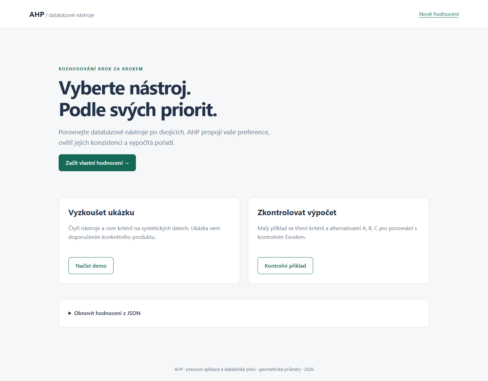
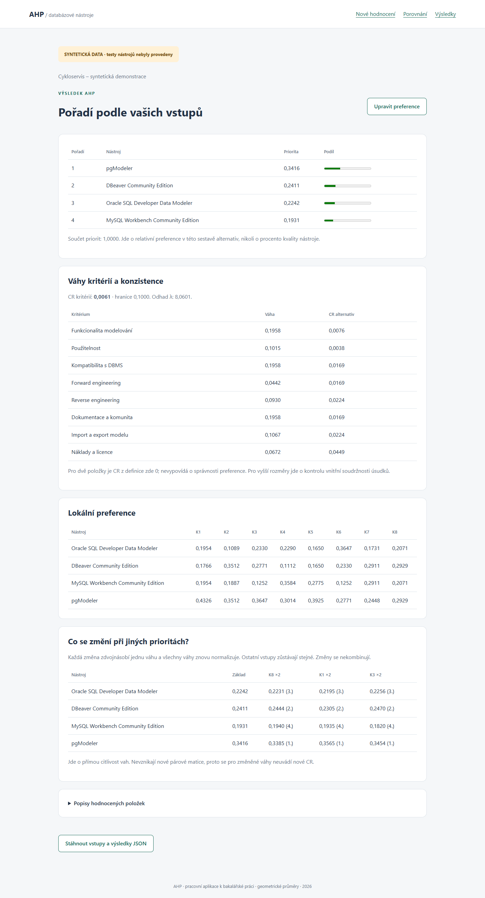

# Univerzita Hradec Králové

Fakulta informatiky a managementu
Katedra informatiky a kvantitativních metod

# Komparace nástrojů pro návrh a vývoj databázových systémů pomocí AHP

**Bakalářská práce – pracovní verze se syntetickými daty**

Autor: Roman Janiš
Studijní program: Aplikovaná informatika
Specializace: Softwarové inženýrství
Vedoucí práce: Ing. et Ing. Martin Lněnička, Ph.D.
Hradec Králové, 2026
Pracovní zpracování: 27. 9. 2026

> **Stav dokumentu:** Souvislý pracovní text, skutečně vytvořená a lokálně zkoušená PHP aplikace, kontrolní sešity a vypočtené syntetické hodnocení. Testy čtyř databázových nástrojů v této verzi provedeny nebyly. Číselné výsledky jejich hodnocení nejsou empirickým zjištěním. Před odevzdáním se musí nahradit vstupy, přepočítat výsledky a upravit také slovní interpretace, abstrakt a závěr. Dokument zatím není finální odevzdávanou verzí.

> **Zachování původního textu:** Kapitoly 4–6 jsou převzaty ze souborů BP beze změny vět. Kapitola 7 je zachována s označenými změnami vět o plánovaných verzích. Původní část kapitoly 8 je zachována a doplněna podrobnějším vymezením. U upravených převzatých pasáží je původní text uveden v hranatých závorkách. Nové praktické kapitoly nemají předchozí znění. Srovnávací poznámky se nezahrnou do finální sazby.

# Prohlášení a zadání práce

[Pracovní poznámka: před konečnou sazbou vložit aktuální znění prohlášení z oficiální fakultní šablony, doplnit skutečné datum a podpis a přiložit aktuální zadávací list ze STAGu. Tato pracovní verze nevytváří podpis ani neprohlašuje, že již proběhla osobní kontrola autora nebo vedoucího. Rozsah využití AI je popsán v kapitole 3.]

# Abstrakt

Práce se zabývá návrhem a implementací webové aplikace pro podporu výběru nástrojů určených pro návrh a vývoj databázových systémů pomocí metody AHP. Teoretická část vymezuje databázové systémy, datové modelování a vícekriteriální rozhodování. Praktická část popisuje hodnoticí kritéria, datový návrh aplikace, výpočet geometrických vah a kontrolu konzistence párových porovnání. Aplikace v jazyce PHP umožňuje využít připravené i vlastní položky, zadat preference, vypočítat pořadí a uložit hodnocení. Výpočty byly porovnány s nezávislým kontrolním skriptem a tabulkovými vzorci. Demonstrace používá modelový případ Cykloservis, čtyři nástroje, osm kritérií a tři samostatné změny důležitosti kritérií. V této pracovní verzi jsou produktová hodnocení syntetická. Výsledné pořadí proto dokládá postup zpracování vstupů, nikoli skutečnou vhodnost porovnávaných produktů. Diskuse vymezuje omezení řešení a podmínky nahrazení zkušebních údajů reálnými testy.

Klíčová slova: databázový systém, návrh databází, datové modelování, AHP, párové porovnávání, PHP.

[Pracovní poznámka – původní znění před úpravou, 27. 9. 2026; důvod: návaznost na cíl BP nebo zpřesnění doloženého stavu.

Práce představuje teoretická a metodická východiska porovnání nástrojů pro návrh a vývoj databázových systémů s využitím metody vícekriteriálního rozhodování AHP (Analytic Hierarchy Process). V první části jsou vymezeny základní pojmy z oblasti databázových systémů, popsány fáze návrhu databáze a vysvětleny datové modely používané při návrhu, zejména entitně-relační model a model relační. Druhá část je věnována vícekriteriálnímu rozhodování, vymezení pojmů alternativa, kritérium a váha kritéria a podrobnému výkladu metody AHP, včetně párového porovnávání, Saatyho škály a kontroly konzistence. Třetí část představuje nástroje, které budou předmětem navazující praktické komparace v bakalářské práci, navrhuje hodnoticí kritéria a popisuje metodický rámec dalšího postupu. Výstupem práce je teoretický a metodický základ, na který naváže praktická část práce.
]

# Abstract

This thesis presents the design and implementation of a web application supporting the selection of database system design and development tools using the Analytic Hierarchy Process. The theoretical part introduces database systems, data modelling and multi-criteria decision making. The practical part describes evaluation criteria, application data structures, geometric-mean priority calculation and consistency assessment. The PHP application supports predefined and custom items, pairwise comparisons, ranking and evaluation export. Calculations were compared with an independent reference script and spreadsheet formulas. The demonstration uses a bicycle service case, four tools, eight criteria and three separate changes in criterion importance. Product evaluations in this working version are synthetic. The resulting ranking therefore demonstrates the processing workflow and does not establish the actual suitability of the products. The discussion outlines limitations and the steps required to replace synthetic inputs with evidence from real tests.

Keywords: database system, database design, data modelling, AHP, pairwise comparison, PHP.

# Obsah

- 1 Úvod
- 2 Cíl práce a výzkumné otázky
- 3 Metodika práce
  - 3.1 Postup vývoje a ověření
  - 3.2 Postup hodnocení nástrojů
  - 3.3 Pracovní syntetická data
  - 3.4 Využití umělé inteligence
- 4 Databázové systémy
  - 4.1 Základní pojmy
  - 4.2 Schéma databáze, instance a metadata
  - 4.3 Funkce DBMS a víceúrovňová architektura
  - 4.4 Fáze návrhu databáze
- 5 Datové modely
  - 5.1 Konceptuální modelování a ER/EER model
    - 5.1.1 Konceptuální modelování a základní pojmy ER modelu
    - 5.1.2 Atributy, EER model a notace
  - 5.2 Relační model
  - 5.3 Transformace ER/EER modelu do relačního modelu
  - 5.4 Normalizace relačního modelu
- 6 Vícekriteriální rozhodování
  - 6.1 Alternativa, kritérium a váha kritéria
  - 6.2 Přístupy k odhadu vah kritérií a porovnání alternativ
  - 6.3 Metoda AHP
    - 6.3.1 Saatyho škála a párové porovnání
    - 6.3.2 Kontrola konzistence
    - 6.3.3 Výhody a omezení AHP
- 7 Nástroje pro návrh a vývoj databází
  - 7.1 Oracle SQL Developer Data Modeler
  - 7.2 DBeaver Community Edition
  - 7.3 MySQL Workbench Community Edition
  - 7.4 pgModeler
- 8 Návrh hodnoticích kritérií
  - 8.1 Upřesnění významu kritérií pro praktické hodnocení
  - 8.2 Vazba kritérií na praktické testování
  - 8.3 Zpracování výsledků pro AHP
- 9 Návrh aplikace pro podporu rozhodování
  - 9.1 Vymezení problému a požadavků
  - 9.2 Datový návrh
  - 9.3 Zvolený výpočetní postup
  - 9.4 Syntéza a citlivost
- 10 Implementace webové aplikace
  - 10.1 Architektura a použité prostředky
  - 10.2 Uživatelský postup
  - 10.3 Kontrola vstupů a chybové stavy
  - 10.4 Uložení a reprodukovatelnost
- 11 Ověření výpočtů a funkčnosti
  - 11.1 Rozsah ověření
  - 11.2 Kontrolní příklad
  - 11.3 Automatické a tabulkové kontroly
  - 11.4 Ověření rozhraní a omezení důkazu
- 12 Demonstrace na modelovém případu Cykloservis
  - 12.1 Rozhodovací situace
  - 12.2 Jednotný postup praktických testů
  - 12.3 Původ a vytvoření syntetických vstupů
  - 12.4 Váhy kritérií a lokální priority
  - 12.5 Výsledná syntéza
  - 12.6 Tři samostatné změny důležitosti kritérií
  - 12.7 Nahrazení zkušebních údajů skutečnými výsledky
- 13 Diskuse výsledků a omezení
  - 13.1 Přínos vytvořeného řešení
  - 13.2 Vztah k odborné literatuře
  - 13.3 Metodická omezení
  - 13.4 Možnosti dalšího rozvoje
- 14 Závěr – pracovní znění pro syntetickou verzi
- Seznam zdrojů
- Přílohy

# Seznam tabulek a obrázků

Tabulka 1: Základní charakteristiky vybraných nástrojů (vlastní zpracování podle Oracle, 2026; DBeaver, 2026; MySQL, 2026; pgModeler, 2026)

Tabulka 2: Přehled navržených hodnoticích kritérií (vlastní zpracování na základě Carvalho et al., 2022)

Tabulka 3: Funkční požadavky aplikace (vlastní zpracování).

Tabulka 4: Datová struktura hodnocení (vlastní zpracování).

Tabulka 5: Členění implementace (vlastní zpracování).

Tabulka 6: Přepočtený kontrolní příklad; vstupy jsou abstraktní, nikoli měření produktů (vlastní výpočet).

Tabulka 7: Rozsah ověření aplikace (vlastní zpracování podle skutečně spuštěných zkoušek).

Tabulka 8: Rozsah modelového případu podle listu Model a pravidla (vlastní zpracování).

Tabulka 9: Váhy kritérií a konzistence v syntetickém běhu (vlastní výpočet ze syntetických vstupů).

Tabulka 10: Lokální priority alternativ v syntetickém běhu (vlastní výpočet ze syntetických vstupů).

Tabulka 11: Výsledné pořadí syntetické demonstrace (vlastní výpočet; nejde o doporučení produktů).

Tabulka 12: Priority při odděleném zesílení K8, K1 a K3 (vlastní výpočet ze syntetických vstupů).

Obrázek 1: Úvodní stránka aplikace

Obrázek 2: Výsledek syntetického příkladu

# 1 Úvod

Návrh databáze obvykle předchází samotné implementaci databázového systému. Kvalita takového datového návrhu značně ovlivňuje spolehlivost, výkon a možnosti dalšího rozšiřování systému. V případě, že při návrhu vzniknou chyby, jejich odstranění je v dalších etapách složité a nákladné. Při návrhu a vývoji databází se proto využívají různé softwarové nástroje, jako například nástroje pro datové modelování, generování Structured Query Language (SQL) skriptů nebo správu databázových schémat. Jednotlivé nástroje se mezi sebou liší rozsahem nabízených funkcí, podporovanými databázovými systémy, možnostmi modelování nebo licenčními podmínkami.

Vybrat vhodný nástroj není v praxi často jednoduché. Obvykle se nedá rozhodovat jen podle jednoho kritéria, například podle ceny nebo rozšířenosti nástroje. Většinou do výběru vstupují další kritéria, která se navzájem dostávají do konfliktu. Proto je vhodné zvolit postup, který umožní jednotlivá kritéria porovnat a následně podle nich rozhodnout, který z nástrojů je nejvhodnější. Díky tomu se do daného hodnocení promítají také zkušenosti a názory hodnotitele, ale zároveň to eliminuje riziko čistě intuitivní volby. Tato bakalářská práce se proto zaměřuje na vytvoření webové aplikace, která podpoří výběr nástroje pro návrh a vývoj databázových systémů.

[Pracovní poznámka – původní znění před úpravou, 27. 9. 2026; důvod: návaznost na cíl BP nebo zpřesnění doloženého stavu.

Tato práce se proto zaměřuje na přípravu teoretických východisek pro porovnání nástrojů pro návrh a vývoj databází.
]
 Pro toto hodnocení je použita metoda vícekriteriálního rozhodování s názvem Analytic Hierarchy Process (AHP).

Teoretická část práce vychází z dříve zpracované seminární práce. Na vymezení databázových systémů, datových modelů a metody AHP navazuje návrh hodnoticích kritérií a vlastní aplikace. V praktické části je popsána implementace, ověření výpočtů a demonstrace na modelovém případu Cykloservis. Pracovní demonstrace používá syntetická data, která umožňují připravit celý postup zpracování. Skutečné vlastnosti nástrojů a jejich vhodnost pro daný případ musí být posouzeny až po provedení jednotných testů.

[Pracovní poznámka – původní znění před úpravou, 27. 9. 2026; důvod: návaznost na cíl BP nebo zpřesnění doloženého stavu.

Práce tak tvoří teoretický a metodický podklad pro navazující praktické porovnání těchto nástrojů. Na úvod se text práce věnuje definicím a termínům spojeným s databázovými systémy, datovým modelováním a návrhem databáze. Vzápětí vysvětluje princip vícekriteriálního rozhodování a metodu AHP. Na tento přístup navazuje výběr nástrojů a návrh hodnoticích kritérií. Tato kritéria a nástroje budou dále použity v praktické části. Výsledné porovnání pak poskytne podklady pro rozhodnutí, který nástroj je vhodný pro konkrétní scénář nasazení, a zároveň ukáže, jak se výsledek mění při změně priorit.
]

# 2 Cíl práce a výzkumné otázky

Cílem bakalářské práce je navrhnout a vytvořit webovou aplikaci pro podporu výběru nástrojů určených pro návrh a vývoj databázových systémů s využitím rozhodovací metody AHP. Aplikace bude umožňovat hodnocení a porovnávání vybraných nástrojů na základě předdefinovaných i uživatelem vytvořených kritérií a preferencí. Součástí práce bude ověření správnosti implementace a demonstrace využití aplikace na vybraném příkladu.

Hlavní cíl je rozpracován do následujících dílčích cílů:

- vymezit teoretická východiska návrhu databází a rozhodování metodou AHP;
- konkretizovat kritéria K1–K8 a čtyři porovnávané nástroje;
- stanovit jednoznačný výpočetní postup a datovou strukturu hodnocení;
- vytvořit aplikaci s připravenými i vlastními položkami a párovými porovnáními;
- ověřit výpočty a obsluhu vstupů na kontrolních případech;
- demonstrovat použití na jednom modelovém případu a posoudit tři změny vah;
- zhodnotit přínos, omezení a možnosti dalšího rozvoje.

Výzkumné a návrhové otázky vyjadřují, co má být před dokončením práce doloženo:

- **VO1:** Jak vymezit kritéria pro výběr nástroje pro návrh a vývoj databázových systémů tak, aby se jejich význam zbytečně nepřekrýval?
- **VO2:** Jak implementovat párové porovnávání, výpočet priorit a kontrolu konzistence tak, aby byl výsledek dohledatelný a nezávisle kontrolovatelný?
- **VO3:** Jak se při použití aplikace na modelovém případu projeví rozdílné preference a tři samostatné změny významu kritérií?

Na první otázku navazuje vymezení kritérií a protokolu. Druhá otázka je řešena návrhem a ověřením aplikace. Třetí otázka je v této pracovní verzi zpracována na syntetických vstupech; věcný závěr o nástrojích bude možný až po jejich skutečném testování. Cílem není nalézt univerzálně nejlepší produkt bez ohledu na potřeby rozhodovatele.

[Pracovní poznámka – původní znění před úpravou, 27. 9. 2026; důvod: návaznost na cíl BP nebo zpřesnění doloženého stavu.

Cílem práce je připravit teoretická a metodická východiska pro porovnání vybraných nástrojů pro návrh a vývoj databázových systémů. K dosažení hlavního cíle je potřeba splnit tyto dílčí cíle:

- vymezit základní pojmy z oblasti databázových systémů, datového modelování a návrhu databáze,
- vysvětlit principy vícekriteriálního rozhodování, metodu AHP a její použitelnost pro porovnání softwarových nástrojů,
- vybrat a charakterizovat nástroje, které budou předmětem porovnávání, a navrhnout hodnoticí kritéria.

Výzkumné otázky navazují na cíl práce a na potřebu postupně připravit teoretický a metodický rámec pro budoucí porovnání nástrojů. Tento rámec zahrnuje vymezení databázových systémů a jejich vývoje, vysvětlení principů vícekriteriálního hodnocení, volbu kritérií a přípravu pro budoucí porovnání. Metoda AHP umožní rozdělit rozhodování na menší přehledné části a přehledně porovnat jak jednotlivá kritéria, tak i jednotlivě hodnocené nástroje.

Tomuto zaměření odpovídají následující výzkumné otázky:

- **VO1:** Jaké klíčové pojmy, modely a postupy se využívají při návrhu a vývoji databázových systémů?
- **VO2:** Jaké principy a postupy nabízí metoda AHP pro porovnání alternativ podle více kritérií?
- **VO3:** Jaká hodnoticí kritéria a jaký postup zvolit pro praktické porovnání nástrojů a jak zdůvodnit jejich výběr?

Odpovědi na uvedené výzkumné otázky postupně tvoří obsah jednotlivých kapitol.
]

# 3 Metodika práce

Zpracování práce probíhalo v několika navazujících krocích. Nejprve byly vymezeny oblasti, které je třeba popsat tak, aby bylo možné nástroje později porovnat a navrhnout vhodná hodnoticí kritéria. Jednalo se o oblasti databázových systémů, datového modelování, návrhu databáze, vícekriteriálního rozhodování a metody AHP. K těmto oblastem byly následně vyhledány odborné zdroje.

Zdroje byly vybírány tak, aby pokryly nejen celou teoretickou část práce, ale i výběr konkrétních nástrojů. Pro databázové systémy byla jako hlavní zdroj použita publikace Pokorného a Valenty (2020). Pro datové modelování a návrh relačních databází byla využita publikace Chlapka, Kučery a Palovské (2019). Metoda AHP byla zpracována na základě práce Saatyho (1990, 2008) a učebního textu Soukopové (2016).

Dalším krokem byl výběr nástrojů, které jsou v práci porovnávány. Při jejich výběru byla využita studie Carvalho et al. (2022), protože se zabývá podobným tématem a porovnává nástroje pro datové modelování jinou metodou. Dále byla použita oficiální dokumentace vybraných nástrojů. Z ní byly převzaty údaje o funkcích, podporovaných databázových platformách, licenčních podmínkách a další podrobnosti. Jako podpůrný zdroj byl použit také článek Simanavičienė a Vdovinskienė (2023), který ukazuje použití metody AHP při výběru softwaru.

Na základě prostudovaných zdrojů byly vybrány nástroje a navržena hodnoticí kritéria. Pro jejich následné skutečné testování je připraven jednotný protokol modelového případu. V této pracovní verzi jsou pomocné známky a párové preference nahrazeny dvěma oddělenými syntetickými sadami. Údaje neslouží k doložení vlastností produktů, ale k přípravě a ověření jejich zpracování v aplikaci a v kontrolním sešitu.

[Pracovní poznámka – původní znění před úpravou, 27. 9. 2026; důvod: návaznost na cíl BP nebo zpřesnění doloženého stavu.

Na základě prostudovaných zdrojů byly následně vybrány nástroje a navržena hodnoticí kritéria. V navazující praktické části budou nástroje hodnoceny podle jednotného postupu. Mezi hodnocená kritéria patří například tvorba modelu, převod do logického a fyzického modelu, generování SQL skriptu, reverzní inženýrství, použitelnost a také licenční podmínky. Výsledky budou následně zpracovány metodou AHP.
]

Porovnávání vstupních preferencí je v aplikaci provedeno metodou AHP. Volba této metody vychází z možnosti propojit kvantitativní a kvalitativní kritéria v jednom hierarchickém modelu a kontrolovat vzájemnou konzistenci párových úsudků (Ishizaka a Labib, 2011; Moreno-Jiménez a Vargas, 2018; Velasquez a Hester, 2013). V této pracovní verzi byl celý výpočetní postup demonstrován na syntetických vstupech. Skutečná komparace vlastností nástrojů bude doplněna po provedení jednotných testů.

Metoda AHP rozloží rozhodovací problém do hierarchické struktury složené z cíle, hodnoticích kritérií a hodnocených nástrojů. V první fázi jsou stanovena a strukturována kritéria vycházející z požadavků identifikovaných v teoretické části práce. Následně jsou jednotlivá kritéria i hodnocené nástroje porovnávány po dvojicích za využití Saatyho devítibodové škály, která umožňuje vyjádřit relativní důležitost jednotlivých prvků. Na základě vytvořených párových matic jsou vypočteny váhy kritérií a preference jednotlivých alternativ, přičemž je současně ověřena konzistence rozhodovacích úsudků prostřednictvím ukazatele konzistence. Výsledkem procesu je stanovení celkového skóre každého nástroje a vytvoření jejich výsledného pořadí podle míry vhodnosti pro definovaný účel. Součástí hodnocení je také analýza citlivosti, jejímž cílem je posoudit stabilitu dosažených výsledků a identifikovat kritéria, která mají největší vliv na konečné pořadí nástrojů (Saaty, 1990; Saaty, 2008).

Pro provádění výpočtů, práci s hodnoticími maticemi a prezentaci výsledků byla vytvořena jednoduchá webová aplikace v PHP. Její rozsah, výpočetní postup a provedené zkoušky jsou popsány v praktické části.

[Pracovní poznámka – původní znění před úpravou, 27. 9. 2026; důvod: návaznost na cíl BP nebo zpřesnění doloženého stavu.

Pro usnadnění provádění výpočtů, správu hodnoticích matic a prezentaci výsledků může být v rámci práce vytvořena jednoduchá podpůrná aplikace implementující základní kroky metody AHP.
]

## 3.1 Postup vývoje a ověření

Praktická část byla připravována v pořadí specifikace, kontrolní příklad, implementace a ověření. Nejprve byly jednoznačně stanoveny povolené vstupy, způsob normalizace, výpočet konzistence a zacházení s chybami. Malý příklad se třemi kritérii byl přepočten nezávislým skriptem. Následně vznikl sešit s viditelnými vzorci a až poté PHP implementace. Tím byl omezen postup, ve kterém by se kontrolní hodnoty dodatečně přizpůsobovaly již vytvořenému programu.

Ověření obsahuje porovnání mezivýsledků i výsledných priorit. Vedle platných matic jsou zkoušeny chybné vstupy a záměrně nekonzistentní preference. Uživatelský průchod je ověřen požadavky HTTP a samostatnou automatizovanou zkouškou v prohlížeči. Vývojové ověření je v textu odlišeno od osobního kontrolního přepočtu autora a od případného posouzení vedoucím práce. Tyto pozdější kontroly nejsou předem prohlašovány za provedené.

## 3.2 Postup hodnocení nástrojů

Pro věcné hodnocení je stanoven jeden modelový případ. V každém nástroji má být podle stejného zadání vytvořen nový model, provedeno generování DDL, zpětné načtení referenční databáze a ověřeny možnosti přenosu modelu. Zápis zahrnuje pozorovaný stav, postup, případné omezení a důkaz. Praktické pozorování se odděluje od informace deklarované v dokumentaci. Pomocná známka 1–5 je pouze součástí záznamu a nestává se automaticky poměrem na Saatyho škále.

Hodnotitelem při následném skutečném srovnání bude autor práce. Jedná se o omezení, protože předchozí zkušenosti a osobní preference mohou ovlivnit zejména použitelnost. Nejde o dotazníkové šetření ani o skupinovou AHP. Vhodnost nástroje bude posuzována pro zadanou situaci a přesnou edici, nikoli obecně pro všechny možné způsoby používání.

## 3.3 Pracovní syntetická data

Syntetické vstupy byly vytvořeny výslovně pro přípravu zpracování. Při jejich generování nebyly provedeny testy databázových nástrojů. Náhodné hodnoty jsou označeny ve vstupních souborech, sešitu, aplikaci i v příslušných částech textu. Při nahrazení skutečnými údaji se budou měnit nejen tabulky, ale také jejich interpretace a závěr. Reprodukovatelnost zajišťuje uložený generátor s pevným inicializačním číslem a úplné vstupní matice.

## 3.4 Využití umělé inteligence

Při přípravě této pracovní verze byl dne 27. 9. 2026 použit nástroj OpenAI Codex. Prostředí asistenta jej identifikuje jako agenta založeného na GPT-6; přesné dílčí označení modelu skutečně použitého pro tento běh nebylo samostatně doloženo. AI byla využita pro audit místních podkladů, návrh datové a výpočetní struktury, vytvoření PHP aplikace, kontrolních skriptů a sešitů, generování označených syntetických dat a sestavení nových praktických kapitol. Původní teoretické pasáže byly převzaty ze souborů BP; změny převzatých vět jsou označeny původním zněním.

Vygenerovaný kód a výpočty byly kontrolovány automatickými zkouškami a přepočtem ve více výpočetních prostředích. Tyto kroky nejsou zaměňovány za osobní nezávislou kontrolu autora. Před odevzdáním musí být výstupy kriticky posouzeny, matematika ručně ověřena, syntetické produktové hodnoty nahrazeny skutečnými testy a doplněna přesná evidence použité verze AI podle dostupných údajů. Zde popsaný rozsah je záměrně širší než jazyková korektura, protože AI podstatně přispěla také k implementaci a k nové praktické části textu.

# 4 Databázové systémy

## 4.1 Základní pojmy

Při práci s databázemi je nutné rozlišovat některé základní pojmy, jako jsou data, informace, databáze a systém řízení báze dat. Pod pojmem data si lze představit jednotlivá fakta nebo zaznamenané hodnoty (Elmasri a Navathe, 2016). Tyto hodnoty samy o sobě nemusí být nositeli žádného širšího významu (Watt a Eng, 2014). Informace pak vznikají právě přiřazením významu datům v určitém kontextu (Elmasri a Navathe, 2016; Watt a Eng, 2014). Pojem databáze pak představuje organizovanou sbírku vzájemně souvisejících dat, která jsou uložena tak, aby s nimi bylo možné dále efektivně pracovat (Elmasri a Navathe, 2016; Pokorný a Valenta, 2020; Watt a Eng, 2014).

Systém řízení báze dat, běžně označovaný jako DBMS, je specializovaný software, který zajišťuje definici, ukládání, manipulaci, zabezpečení a správu dat uložených v databázi (Elmasri a Navathe, 2016; Pokorný a Valenta, 2020). Spojení databáze s DBMS vytvoří databázový systém, který usnadňuje definování, vytváření, manipulaci a sdílení databáze mezi různými uživateli a aplikacemi (Elmasri a Navathe, 2016). DBMS v rámci tohoto systému zajišťuje transakční zpracování, obnovení dat po pádu, souběžný přístup více uživatelů i řízení ochrany dat (Pokorný a Valenta, 2020).

Původně se používal především jednoduchý souborový přístup, který měl však řadu problémů a omezení, například v podobě nekonzistentnosti dat při aktualizaci, závislosti na aplikačním programu a na fyzické struktuře, často spojené s redundancí dat (Elmasri a Navathe, 2016). Databázový přístup tyto nedostatky odstraňuje, a to tím, že integruje data do jednoho logického celku a odděluje definici dat od samotných aplikací (Pokorný a Valenta, 2020). Tímto oddělením se získává vyšší bezpečnost, možnost centrálního řízení integritních omezení a možnost sdílení dat mezi více uživateli (Elmasri a Navathe, 2016; Pokorný a Valenta, 2020).

## 4.2 Schéma databáze, instance a metadata

V teorii databází je třeba rozlišovat mezi schématem databáze a instancí databáze. Schéma databáze představuje popis struktury uložených dat a zahrnuje určení entit, atributů, vazeb a integritních omezení, která mají data splňovat (Pokorný a Valenta, 2020). Pojem instance databáze naopak vyjadřuje konkrétní aktuální obsah databáze v určitém čase (Elmasri a Navathe, 2016; Pokorný a Valenta, 2020). Toto rozlišení odděluje relativně stabilní strukturální návrh od proměnlivých datových hodnot (Elmasri a Navathe, 2016).

S databázovým systémem souvisí také pojem metadata. Metadata jsou data o datech. Tato data tedy popisují strukturu databáze, význam atributů, integritní omezení nebo například přístupová práva (Elmasri a Navathe, 2016; Pokorný a Valenta, 2020). Metadata bývají ukládána v systémovém katalogu, který slouží jako centrální zdroj informací o databázových objektech (Elmasri a Navathe, 2016; Pokorný a Valenta, 2020).

Správa a údržba schématu databáze je klíčovou rolí správce databáze (DBA), přičemž změny schématu v průběhu životního cyklu systému musí být pečlivě kontrolovány (Elmasri a Navathe, 2016; Pokorný a Valenta, 2020). Metadata uložená v systémovém katalogu jsou využívána nejen samotným DBMS pro optimalizaci dotazů a kontrolu přístupových práv, ale také externími nástroji (Elmasri a Navathe, 2016). Tyto nástroje dokážou metadata z katalogu načíst a vizualizovat je ve formě diagramů. Tato vizualizace pak usnadňuje pochopení existující struktury databáze a její další rozvoj (Pokorný a Valenta, 2020).

## 4.3 Funkce DBMS a víceúrovňová architektura

DBMS obvykle poskytuje několik základních skupin funkcí: definici dat, manipulaci s daty, řízení souběžného přístupu více uživatelů, ochranu dat a obnovu po chybě (Pokorný a Valenta, 2020). Pro tyto funkce se používá jazyk DDL (Data Definition Language), který slouží k definici dat, a pak jazyk DML (Data Manipulation Language) určený pro manipulaci s daty. Vedle toho se používá pojem transakce, což je logický celek operací, který má být proveden buď celý, nebo vůbec (Elmasri a Navathe, 2016).

Další významnou myšlenkou bylo chápat DBMS jako víceúrovňový systém podle modelu ANSI/SPARC. Tento přístup představuje databázi jako hierarchii abstrakcí, které oddělují externí, konceptuální a interní úroveň (Elmasri a Navathe, 2016; Pokorný a Valenta, 2020). Ve zprávě výboru ANSI/X3/SPARC z roku 1975 se toto členění upřesňuje takto: externí úroveň odpovídá pohledům jednotlivých skupin uživatelů, konceptuální úroveň představuje globální logický model celé databáze a interní úroveň popisuje fyzické uložení dat. Hlavním smyslem tohoto členění je podpora datové nezávislosti, tedy oddělení aplikací a uživatelských pohledů od fyzické implementace databáze (Elmasri a Navathe, 2016; Pokorný a Valenta, 2020; Watt a Eng, 2014).

Pro následné porovnání nástrojů v této práci je toto rozdělení vhodné proto, že nástroje nepokrývají všechny úrovně databázového systému stejným způsobem (Rosenthal a Reiner, 1994). Některé se zaměřují především na konceptuální nebo logický model, jiné podporují i fyzické prvky konkrétního DBMS, například datové typy, indexy nebo generování SQL skriptů (Carvalho et al., 2022). Při hodnocení nástrojů proto bude vhodné sledovat nejen možnosti vytváření diagramů, ale také podporu přechodu mezi jednotlivými úrovněmi návrhu a implementace (Rosenthal a Reiner, 1994).

## 4.4 Fáze návrhu databáze

Návrh databáze představuje jednu z hlavních fází v rámci životního cyklu vývoje databázového systému a probíhá v několika na sebe navazujících krocích. Přímý přechod k fyzické implementaci tabulek v konkrétním systému může vést k chybám v návrhu, redundanci a omezené rozšiřitelnosti (Carvalho et al., 2022). Z tohoto důvodu se v literatuře standardně rozlišuje konceptuální, logický a fyzický návrh (Elmasri a Navathe, 2016; Pokorný a Valenta, 2020; Rosenthal a Reiner, 1994).

Konceptuální návrh zachycuje strukturu aplikační domény bez vazby na konkrétní databázový systém (Carvalho et al., 2022; Rosenthal a Reiner, 1994). V této fázi jsou identifikovány entity, vztahy mezi nimi, atributy a základní integritní omezení. Výsledkem je konceptuální schéma, které věrně popisuje realitu a je nezávislé na zvoleném DBMS (Carvalho et al., 2022; Pokorný a Valenta, 2020).

Na konceptuální návrh navazuje logický návrh. V této části se konceptuální model převádí do zvoleného datového modelu, v případě této práce jde zejména o model relační (Rosenthal a Reiner, 1994). Dochází k návrhu relací, atributů, klíčů, cizích klíčů a integritních omezení. Výsledkem je logické schéma databáze, které lze implementovat v konkrétním DBMS (Elmasri a Navathe, 2016; Pokorný a Valenta, 2020).

Ve fyzickém návrhu se řeší způsob uložení dat v konkrétním databázovém systému (Pokorný a Valenta, 2020; Rosenthal a Reiner, 1994). Řeší se zde organizace datových souborů, indexy, výkonové aspekty, optimalizace přístupu a další technické detaily (Rosenthal a Reiner, 1994). Na rozdíl od konceptuálního a logického návrhu je fyzický návrh silně závislý na konkrétní technologii (Pokorný a Valenta, 2020).

Mezi jednotlivými kroky návrhu existuje zpětná vazba. Pokud se při fyzickém návrhu ukáže, že některé části modelu vedou například k výkonovým problémům, je nutné vrátit se zpět k logickému návrhu (Rosenthal a Reiner, 1994). Podobně může změna požadavků uživatelů vyvolat úpravu konceptuálního modelu a následně i všech dalších úrovní (Carvalho et al., 2022; Rosenthal a Reiner, 1994). Návrh databáze proto nelze chápat jako striktně lineární proces, ale jako iterativní postup, v němž se schéma průběžně zpřesňuje, opravuje a reorganizuje (Carvalho et al., 2022; Rosenthal a Reiner, 1994).

Rozdělení návrhu databáze na konceptuální, logickou a fyzickou úroveň tvoří vhodný výchozí bod pro pozdější definici hodnoticích kritérií. Nástroj určený pro návrh databázového systému by měl umožnit zachytit požadavky, převést je do konzistentního schématu a podle potřeby podpořit technickou implementaci v konkrétním databázovém prostředí (Rosenthal a Reiner, 1994). Úroveň podpory těchto kroků představuje důležitý ukazatel kvality daného nástroje (Carvalho et al., 2022; Rosenthal a Reiner, 1994).

# 5 Datové modely

Datový model poskytuje formalizovaný nástroj, který slouží k popisu dat, jejich struktur a vztahů mezi nimi (Elmasri a Navathe, 2016; Pokorný a Valenta, 2020). Definuje datové objekty a jejich vzájemné vztahy včetně omezení, která se jich týkají. Datový model je zjednodušený popis reality, který je vytvořen tak, aby se podle něj dala navrhnout a implementovat databáze (Elmasri a Navathe, 2016; Pokorný a Valenta, 2020).

## 5.1 Konceptuální modelování a ER/EER model

### 5.1.1 Konceptuální modelování a základní pojmy ER modelu

Konceptuální modelování slouží k zachycení požadavků aplikační domény, kterou má navrhovaný systém pokrývat, ale bez ohledu na konkrétní databázovou technologii (Carvalho et al., 2022; Chlapek, Kučera a Palovská, 2019). Jeho cílem je vytvořit přehledný a věrný model reálného světa (Carvalho et al., 2022). V praxi se pro tuto fázi velmi často používá entitně-relační model (ER model) (Chen, 1976), případně jeho rozšířená varianta Enhanced Entity-Relationship (EER) model (Elmasri a Navathe, 2016).

Základními pojmy ER modelu jsou entita, entitní množina, vztah a atribut. Za entitu je považován objekt, který je schopen samostatné existence a lze jej jednoznačně odlišit od ostatních objektů (Chen, 1976). Entitní množina je pak množina entit, které jsou stejného typu a mají společné vlastnosti (Chen, 1976). Vztah vyjadřuje vazbu mezi entitami nebo entitními množinami a atribut představuje vlastnost entity nebo vztahu (Chen, 1976).

Vztahy mezi entitami lze popsat například kardinalitou a participací. Kardinalita udává, kolik entit jedné množiny může být ve vztahu k entitě jiné množiny (Elmasri a Navathe, 2016). Typickými případy jsou vazby 1:1, 1:N a M:N. Participace vyjadřuje, zda je účast entity ve vztahu povinná nebo nepovinná (Elmasri a Navathe, 2016). Tyto pojmy jsou důležité nejen na konceptuální úrovni, ale i pro následnou transformaci do relačního modelu (Pokorný a Valenta, 2020).

### 5.1.2 Atributy, EER model a notace

Atributy jsou svázány s doménami, tedy s množinami přípustných hodnot (Elmasri a Navathe, 2016). Rozlišujeme jednoduché a složené atributy, případně i další typy (Elmasri a Navathe, 2016; Pokorný a Valenta, 2020). Pro jednoznačnou identifikaci entit slouží kandidátní a primární klíče (Elmasri a Navathe, 2016).

Rozšířený ER model (EER) doplňuje základní ER model o supertřídy, podtřídy a dědičnost atributů (Elmasri a Navathe, 2016). EER model je vhodný především tam, kde je potřeba přesněji vystihnout specializaci nebo generalizaci objektů (Elmasri a Navathe, 2016). V praxi se ER/EER model vyjadřuje různými grafickými notacemi, přičemž mezi nejčastější patří Chenova notace a Crow’s Foot. Alternativně lze pro modelování datových struktur využít také UML diagram tříd (Carvalho et al., 2022; Chlapek, Kučera a Palovská, 2019).

Pro hodnocení databázových nástrojů je podpora konceptuálního modelování významná hlavně z praktického hlediska. Nástroj by měl umožnit vyjádřit entity, vztahy, kardinality a omezení způsobem, který je srozumitelný jak analytikům, tak i vývojářům (Carvalho et al., 2022). Jednotlivé nástroje se přitom mohou lišit použitou notací, úrovní podpory EER prvků a možností následného převodu modelu do relačního schématu (Carvalho et al., 2022; Rosenthal a Reiner, 1994).

## 5.2 Relační model

Relační model je založen na relacích, které se v praxi obvykle zobrazují jako tabulky (Elmasri a Navathe, 2016). Každá relace má své schéma, tedy jméno relace, seznam atributů a jejich domén (Pokorný a Valenta, 2020). Konkrétní řádky tabulky odpovídají n-ticím (Codd, 1970; Elmasri a Navathe, 2016). Relační model pracuje s atomickými hodnotami a s přesně vymezenými atributy (Codd, 1970; Elmasri a Navathe, 2016).

Klíče jsou v relačním modelu zásadní. Primární klíč slouží k jednoznačné identifikaci řádku tabulky (Elmasri a Navathe, 2016; Pokorný a Valenta, 2020). Cizí klíč umožňuje vyjádřit vazbu mezi tabulkami a je základem referenční integrity (Watt a Eng, 2014). Mezi obecné vlastnosti relačních tabulek patří nezávislost na pořadí řádků a sloupců a požadavek na neduplicitu řádků (Codd, 1970; Elmasri a Navathe, 2016).

Relační model je pro tuto práci důležitý také proto, že většina běžně používaných návrhových nástrojů pro databáze směřuje k tvorbě relačního schématu a k práci s SQL databázemi. Při jejich porovnání proto bude důležité, zda nástroj podporuje definici primárních a cizích klíčů, integritních omezení, datových typů a generování nebo zpětné načítání databázového schématu (Carvalho et al., 2022).

## 5.3 Transformace ER/EER modelu do relačního modelu

Při přechodu z konceptuálního modelu k modelu relačnímu se entity obvykle převádějí na tabulky a atributy na sloupce (Chlapek, Kučera a Palovská, 2019). Vztahy typu 1:N se zpravidla reprezentují pomocí cizího klíče na straně N, zatímco pro vztahy M:N je vyžadováno vytvoření samostatné spojovací tabulky. Specifické případy představují vztahy 1:1, atributy vztahů nebo převod supertříd a podtříd (Elmasri a Navathe, 2016). Tato transformace je důležitým přechodem mezi konceptuálním a logickým návrhem (Rosenthal a Reiner, 1994). Pokud je tato transformace provedena nekonzistentně, vede k problémům v následné implementaci (Carvalho et al., 2022; Rosenthal a Reiner, 1994).

U nástrojů pro návrh databází je proto důležité, zda převod mezi konceptuálním a relačním modelem pouze vizuálně naznačují, nebo zda tento převod dokážou částečně automatizovat a kontrolovat (Carvalho et al., 2022; Rosenthal a Reiner, 1994). Automatické generování relačního schématu může práci urychlit, ale je potřeba ověřit, zda nástroj také správně zachází s kardinalitami, vazbami M:N, povinnými atributy a integritními omezeními (Carvalho et al., 2022).

## 5.4 Normalizace relačního modelu

Normalizace je proces, jehož cílem je odstranit nadbytečnost dat a předcházet anomáliím při vkládání, aktualizaci a mazání údajů (Codd, 1970; Elmasri a Navathe, 2016). Teoretickým základem normalizace jsou funkční závislosti, které určují vztahy mezi atributy a umožňují identifikovat nadbytečnost a anomálie v databázovém schématu (Codd, 1970; Elmasri a Navathe, 2016).

Normální formy představují soubor pravidel pro návrh relační databáze, jejichž cílem je omezit redundanci dat a snížit riziko nekonzistence. První normální forma vyžaduje, aby atributy obsahovaly pouze atomické hodnoty a aby se v tabulkách nevyskytovaly skupiny, které se opakují (Codd, 1970; Elmasri a Navathe, 2016). Druhá normální forma se zaměřuje na tabulky se složeným klíčem a požaduje, aby každý neklíčový atribut závisel na celém klíči, nikoli pouze na jeho části (Codd, 1970; Elmasri a Navathe, 2016). Třetí normální forma dále odstraňuje tranzitivní závislosti, u nichž jeden neklíčový atribut závisí na jiném neklíčovém atributu (Codd, 1970; Elmasri a Navathe, 2016). Dodržování těchto forem podle Codda (1970) a Elmasriho s Navathem (2016) vede k zajištění základní konzistence relačního schématu. Z toho důvodu by tato pravidla měla respektovat většina nástrojů pro návrh databází.

Normalizace ukazuje mimo jiné, že kvalita návrhového nástroje nespočívá jen v grafické podobě diagramu. Důležité je, zda nástroj podporuje konzistenci modelu, upozorňuje na chybějící klíče nebo problematické vazby a umožňuje vytvořit návrh, který lze převést do udržitelného relačního schématu. Tato hlediska navazují na pozdější výběr hodnoticích kritérií pro komparaci nástrojů (Carvalho et al., 2022).

# 6 Vícekriteriální rozhodování

Vícekriteriální rozhodování se zabývá situacemi, ve kterých nelze rozhodnout podle jednoho hlediska (Mardani et al., 2015). V běžných rozhodovacích úlohách jsou alternativy obvykle hodnoceny podle více kritérií. Tato kritéria však mohou být ve vzájemném konfliktu (Velasquez a Hester, 2013). Z tohoto důvodu se používají metody, které umožňují tato kritéria systematicky zahrnout do rozhodovacího procesu a výsledek rozhodnutí zdůvodnit (Mardani et al., 2015).

Rozhodovací úloha je běžně popsána množinou variant, množinou hodnoticích kritérií a vztahem mezi nimi (Soukopová, 2016). Varianty představují jednotlivé posuzované možnosti, mezi kterými se rozhoduje. Kritéria určují, z jakých hledisek jsou jednotlivé varianty hodnoceny (Velasquez a Hester, 2013). Hodnocení variant podle jednotlivých kritérií se často zapisuje do kriteriální matice. Tato matice umožňuje zachytit přehledně hodnoty alternativ vzhledem k jednotlivým kritériím (Soukopová, 2016).

S vícekriteriálním rozhodováním souvisejí i pojmy jako ideální a bazální varianta, dominance a nedominované řešení. Ideální varianta je hypotetická varianta, která ve všech kritériích získává nejlepší možné hodnoty (Soukopová, 2016; Velasquez a Hester, 2013). Bazální varianta naopak představuje hypotetickou variantu s nejhoršími hodnotami. Dominance vyjadřuje vztah mezi dvěma variantami, kdy jedna varianta je alespoň v jednom kritériu lepší a v ostatních není horší než druhá varianta. Nedominovaná varianta je taková varianta, pro kterou neexistuje jiná varianta lepší alespoň v jednom kritériu a současně ne horší v ostatních (Soukopová, 2016). Tyto pojmy se používají především u metod, které pracují se vzdáleností od ideálního řešení nebo s porovnáváním dominance mezi variantami (Velasquez a Hester, 2013).

Pro tuto práci je důležité zejména vícekriteriální hodnocení variant. Důvodem je porovnání konečného seznamu nástrojů pro návrh a vývoj databázových systémů. Jde tedy o případ, kdy jsou předem dány alternativy a z těchto alternativ je nutné určit nejvhodnější řešení (Mardani et al., 2015; Saaty, 1990). Cílem přitom není označit jeden nástroj za univerzálně nejvhodnější, ale vysvětlit jeho vhodnost vzhledem ke zvoleným kritériím, jejich vahám a uvažovanému použití (Saaty, 2008; Soukopová, 2016).

Při rozhodování o výběru softwarových nástrojů je vícekriteriální přístup vhodný proto, že rozhodnutí obvykle zahrnuje technická, ekonomická a uživatelská hlediska (Mardani et al., 2015; Velasquez a Hester, 2013). U databázových nástrojů jsou obvykle některá kritéria měřitelná přímo, například cena, licence nebo dostupnost pro konkrétní platformu. Jiná kritéria naopak mají popisnou povahu, například přehlednost uživatelského rozhraní, podpora modelování nebo srozumitelnost dokumentace. Vícekriteriální metody pomáhají přehledně spojit všechna důležitá hlediska do jednoho rozhodovacího procesu (Mardani et al., 2015).

## 6.1 Alternativa, kritérium a váha kritéria

Alternativa představuje jednu z možných variant rozhodnutí (Soukopová, 2016). V této práci každá alternativa představuje konkrétní softwarový nástroj určený pro návrh a vývoj databázových systémů. Kritérium je hledisko, podle kterého se jednotlivé alternativy posuzují (Soukopová, 2016). Může jít například o funkcionalitu, použitelnost, kompatibilitu s různými DBMS, podporu reverzního inženýrství nebo cenu (Carvalho et al., 2022).

Samotná kritéria lze uspořádat různými způsoby podle potřeb konkrétní rozhodovací úlohy. Základní dělení odlišuje kritéria maximalizační a minimalizační (Soukopová, 2016). U maximalizačních kritérií je požadována co nejvyšší hodnota, například rozsah funkcí nebo počet podporovaných databázových platforem. U minimalizačních kritérií je naopak požadována co nejnižší hodnota, například cena, časová náročnost zavedení nebo složitost práce. Kritéria mohou být kvantitativní nebo kvalitativní, a jejich kombinace je u hodnocení softwaru zcela běžná (Soukopová, 2016; Velasquez a Hester, 2013).

Váha kritéria vyjadřuje jeho relativní význam v rámci rozhodovacího procesu (Saaty, 1990; Soukopová, 2016). Ne všechna kritéria mají stejnou důležitost, a proto je nutné jejich význam určit explicitně. Určení vah kritérií je jedním z klíčových kroků většiny vícekriteriálních metod. Právě váhy často zásadně ovlivňují výsledné pořadí alternativ (Saaty, 1990).

Při volbě vah je důležité vycházet z účelu hodnocení (Saaty, 2008; Soukopová, 2016). V prostředí s omezeným rozpočtem může být cena klíčová, zatímco ve firmě, která už používá určitou databázovou platformu, může mít větší váhu právě její podpora. Stejný nástroj proto může být v jednom rozhodovacím scénáři vhodnější než v jiném. Z tohoto důvodu jsou kritéria navázána na modelovou situaci Cykloservisu a na požadavky rozhodovatele (Saaty, 2008).

## 6.2 Přístupy k odhadu vah kritérií a porovnání alternativ

Pro odhadnutí vah jednotlivých kritérií lze použít několik postupů (Saaty, 2008; Soukopová, 2016). Mezi nejznámější jednoduché přístupy patří metoda pořadí nebo bodovací metoda. Tyto metody lze použít jednoduše, ale nejsou dostatečně přesné při popisu toho, jak výrazně je jedna z možností důležitější než druhá. Pokročilejší postupy pracují s párovým porovnáváním kritérií a do této skupiny patří právě i Saatyho metoda, která je s metodou AHP přímo spojena (Saaty, 1990; Soukopová, 2016).

Při hodnocení samotných alternativ umožňuje AHP použít stejný princip párového porovnávání i pro alternativy, a to vzhledem ke každému z dříve stanovených kritérií (Saaty, 2008; Vaidya a Kumar, 2006). Výhodou pak je systematičnost a transparentnost, naopak nevýhodou je vyšší pracnost při větším počtu prvků. Počet porovnání roste s počtem kritérií a alternativ. Proto je vhodné zvolit přiměřený rozsah rozhodovacího modelu (Ishizaka a Labib, 2011).

Z dalších metod vícekriteriálního hodnocení variant jsou rozšířeny především metoda váženého součtu (WSA), metoda TOPSIS a metody založené na outrankingu. Metoda váženého součtu pracuje s normalizovanými hodnotami kritérií a výsledné skóre alternativy vypočítá jako vážený součet (Soukopová, 2016; Velasquez a Hester, 2013). TOPSIS hodnotí alternativy podle jejich vzdálenosti od ideální a bazální varianty (Velasquez a Hester, 2013). Komplexnější strukturou se vyznačuje rodina metod ELECTRE, které pracují s koncepty převahy jedné varianty nad druhou (Mardani et al., 2015; Velasquez a Hester, 2013).

Pro potřeby práce je metoda AHP vhodná ze tří důvodů. Za prvé, AHP umožňuje pracovat současně s kvantitativními i kvalitativními kritérii, a to dokonce bez nutnosti převádět jednotlivá hodnocení na jednotnou měrnou škálu (Ishizaka a Labib, 2011; Saaty, 1990). Za druhé, je postup metody srozumitelný a vysvětlitelný, protože pracuje s hierarchií cíle, kritérií a alternativ (Saaty, 2008). Za třetí, AHP pomocí poměru konzistence umožňuje zkontrolovat, zda na sebe jednotlivá hodnocení logicky navazují. To je zvlášť užitečné v situacích, kdy párové porovnávání provádí jen jedna osoba (Ishizaka a Labib, 2011; Saaty, 1990).

## 6.3 Metoda AHP

Metoda AHP patří mezi nejznámější metody vícekriteriálního rozhodování (Ishizaka a Labib, 2011; Moreno-Jiménez a Vargas, 2018; Vaidya a Kumar, 2006). Jejím autorem je Thomas L. Saaty. Podstata této metody spočívá v rozdělení složitého rozhodovacího problému do přehledné hierarchie, která obsahuje hlavní cíl, kritéria, případně subkritéria a jednotlivé alternativy (Saaty, 1990; Saaty, 2008). Díky tomuto rozkladu lze lépe porozumět struktuře rozhodovací úlohy a následně jednotlivé prvky systematicky porovnat (Vaidya a Kumar, 2006).

Na nejvyšší úrovni hierarchie se nachází hlavní cíl rozhodování, například výběr nejvhodnějšího databázového nástroje (Saaty, 2008). Pod ním se nacházejí kritéria, případně subkritéria, a na nejnižší úrovni stojí jednotlivé alternativy. Hlavní myšlenkou metody je porovnat dva prvky na stejné úrovni a určit jejich relativní důležitost vzhledem k nadřazenému prvku (Saaty, 1990; Saaty, 2008).

AHP se využívá hlavně v případech, kdy je potřeba při rozhodování spojit různé typy kritérií, například technické parametry, ekonomické ukazatele a kritéria, která se hodnotí spíše subjektivně nebo kvalitativně (Ishizaka a Labib, 2011; Saaty, 1990). Pro tuto práci je tato metoda vhodná, protože jednotlivé nástroje pro návrh a vývoj databázových systémů nelze hodnotit jen kvantitativně jednou měřitelnou veličinou. Kromě ceny nebo podpory konkrétního DBMS je třeba zohlednit i další vlastnosti – například jaké modelovací funkce nabízí, jak se s ním pracuje, jak kvalitní je dokumentace, zda podporuje reverzní inženýrství a jaké možnosti poskytuje pro generování SQL skriptů. Přehledové studie ukazují, že AHP se využívá v mnoha různých typech rozhodovacích úloh a je vhodná i pro situace, kdy je potřeba vybírat mezi softwarovými systémy (Ho, 2008; Moreno-Jiménez a Vargas, 2018; Simanavičienė a Vdovinskienė, 2023; Vaidya a Kumar, 2006).

Typický postup AHP lze shrnout do několika kroků. Nejprve je vymezen cíl rozhodování a sestavena hierarchie kritérií a alternativ (Saaty, 2008). Poté se provedou párová porovnání kritérií vzhledem k cíli a párová porovnání alternativ vzhledem ke každému kritériu (Saaty, 1990). Z těchto porovnání se vypočítají lokální priority a ověří se konzistence úsudků. Nakonec se lokální váhy agregují do celkového pořadí alternativ (Ishizaka a Labib, 2011; Saaty, 2008).

### 6.3.1 Saatyho škála a párové porovnání

Při párovém porovnávání se používá Saatyho škála. Základní hodnoty této škály jsou 1, 3, 5, 7 a 9, které vyjadřují stejnou důležitost, mírnou, silnou, velmi silnou až absolutní preferenci (Saaty, 1990; Saaty, 2008). Sudé hodnoty 2, 4, 6, 8 jsou chápány jako mezistupně. Pokud je jeden prvek méně významný než druhý, použije se převrácená hodnota (Ishizaka a Labib, 2011; Saaty, 1990). Hodnota 1 tedy znamená rovnocennost dvou prvků, zatímco hodnota 9 vyjadřuje krajní převahu jednoho prvku nad druhým.

Výsledkem párového porovnání je čtvercová reciproční matice, označovaná jako Saatyho matice (Saaty, 1990). Reciproční povaha matice znamená, že pokud je prvek A vůči prvku B hodnocen hodnotou 5, pak opačné porovnání B vůči A má hodnotu 1/5 (Ishizaka a Labib, 2011; Saaty, 2008). Hlavní diagonála matice obsahuje hodnoty 1, protože každý prvek je sám se sebou stejně důležitý.

Z této matice se následně vypočítají lokální váhy. V odborné literatuře se objevují různé způsoby výpočtu vah v metodě AHP, například postup založený na vlastním vektoru nebo metoda využívající geometrický průměr řádků (Ishizaka a Labib, 2011; Saaty, 1990). Výsledkem výpočtu je vektor priorit. Hodnoty vektoru priorit vyjadřují relativní význam porovnávaných prvků (Saaty, 1990; Saaty, 2008). U kritérií tyto hodnoty představují jejich váhy, u alternativ pak jejich lokální hodnocení vzhledem ke konkrétnímu kritériu.

Pro tuto práci je důležité, že párové porovnávání umožňuje hodnotiteli vyjadřovat preference postupně a přehledně. Místo toho, aby musel přímo přiřazovat přesné váhy všem kritériím, posuzuje vždy jen dvojici prvků a rozhoduje, který z nich je vzhledem k danému cíli nebo kritériu důležitější (Saaty, 2008). To je užitečné zejména u kritérií, která nejsou přímo měřitelná, například přehlednost prostředí nebo kvalita podpory modelování (Saaty, 1990).

### 6.3.2 Kontrola konzistence

Protože párové porovnávání vychází z lidského úsudku, není vždy dokonale konzistentní. Součástí metody AHP je proto kontrola konzistence. K tomu slouží Consistency Index (CI), Random Consistency Index (RI) a Consistency Ratio (CR) (Ishizaka a Labib, 2011; Saaty, 1990). V praxi se uvažuje, že hodnota CR menší než 0,1 značí přijatelnou úroveň konzistence. Vyšší hodnoty poměru konzistence (CR) obvykle vedou k přehodnocení porovnání (Saaty, 1990; Saaty, 2008).

Konzistence ověřuje, zda jsou jednotlivé úsudky hodnotící osoby vzájemně logické a v souladu a zda si navzájem neodporují (Ishizaka a Labib, 2011; Saaty, 2008). Pokud je například kritérium A výrazně důležitější než kritérium B a kritérium B je důležitější než kritérium C, potom by mělo být kritérium A zároveň důležitější než kritérium C. Menší odchylky jsou při rozhodování přirozené, příliš vysoká nekonzistence však snižuje důvěryhodnost výsledků (Saaty, 1990; Saaty, 2008).

Možnost ověřit konzistenci je jedním z důvodů, proč je AHP pro tuto práci vhodnější než jednodušší bodovací postup. Při hodnocení databázových nástrojů bude část úsudků založena na kvalitativním posouzení, například u použitelnosti nebo přehlednosti práce s modelem. Ukazatel CR umožňuje ověřit, zda jsou tato porovnání vnitřně soudržná, a případně se k problematickým porovnáním vrátit (Ishizaka a Labib, 2011; Saaty, 1990; Saaty, 2008).

### 6.3.3 Výhody a omezení AHP

Výhody metody AHP byly stručně naznačeny již v kapitole 6.2, a to možnost kombinovat kvantitativní i kvalitativní kritéria, srozumitelnost postupu a kontrola konzistence úsudků. Následující text pak tyto výhody rozvádí a doplňuje je o další přínosy metody a uvádí i její hlavní omezení. Metoda současně umožňuje analýzu citlivosti, tedy sledování dopadu změny vah kritérií na výsledné pořadí (Ho, 2008; Saaty, 2008). To je důležité zejména tehdy, když jsou výsledky citlivé na malé změny preferencí a kdy je třeba ověřit stabilitu doporučení.

Nevýhodou metody je pracnost při větším počtu kritérií a alternativ a jistá míra subjektivity, která je s párovým porovnáváním spojena (Ishizaka a Labib, 2011; Saaty, 2008). Pokud je v modelu mnoho prvků, počet potřebných porovnání rychle roste. Hodnotitel pak může být zatížen opakováním podobných rozhodnutí (Ishizaka a Labib, 2011). Proto je vhodné udržet počet kritérií i alternativ v přiměřeném rozsahu a jasně vymezit význam jednotlivých kritérií.

V odborné literatuře se diskutuje jev rank reversal, tedy možná změna pořadí alternativ při přidání nebo odebrání varianty z modelu (Ishizaka a Labib, 2011; Saaty, 2008; Vaidya a Kumar, 2006). Tento problém neznamená, že AHP nelze použít, ale ukazuje, že výsledky je třeba interpretovat s ohledem na zvolený soubor alternativ a nastavení modelu. V praktické části je proto zdůvodněno, proč byly vybrány právě dané nástroje a jaké požadavky reprezentují.

V souvislosti s výběrem databázového nástroje je AHP užitečná tím, že umožňuje oddělit stanovení vah kritérií od samotného hodnocení alternativ (Catak et al., 2012; Ebrahimi a Taheri, 2015; Simanavičienė a Vdovinskienė, 2023). Nejprve je možné určit, jak významná je například funkcionalita, použitelnost, kompatibilita, cena nebo podpora vývojového procesu, a teprve poté hodnotit jednotlivé nástroje vůči těmto kritériím (Saaty, 1990). Díky tomu je výsledné pořadí zdůvodněno explicitně, nikoli pouze celkovým dojmem.

# 7 Nástroje pro návrh a vývoj databází

Výběr nástrojů pro porovnání vycházel nejprve z přehledu dostupných nástrojů pro návrh a vývoj databází. Jako jeden z podkladů byla využita studie Carvalho et al. (2022), která hodnotila sedmnáct nástrojů pro datové modelování. Ze studie vyplývá, že nabídka těchto nástrojů je velmi široká a obsahuje nástroje online i desktopové, bezplatné i komerční a také nástroje zaměřené na různé databázové platformy. Příkladem online nástroje je ONDA vyvinutý na Univerzitě v Coimbře (Laranjeiro a Pinto, 2024), který však do výběru zařazen nebyl, protože práce se soustředí na plnohodnotné desktopové nástroje. Dalším podkladem byla oficiální online dokumentace vybraných nástrojů, ze které byly ověřeny jejich základní funkce, podporované databázové platformy a licenční podmínky. Pro posouzení významu jednotlivých databázových platforem byl využit také žebříček DB-Engines (2026).

Na základě těchto podkladů byly pro další práci vybrány čtyři nástroje: Oracle SQL Developer Data Modeler, DBeaver Community Edition, MySQL Workbench Community Edition a pgModeler. Při výběru bylo zohledněno, zda vybraný nástroj podporuje návrh databáze, zda je dostupný v bezplatné nebo volně testovatelné verzi a zda vhodně doplňuje ostatní vybrané nástroje. Oracle SQL Developer Data Modeler je zaměřený hlavně na Oracle Database, MySQL Workbench na MySQL, pgModeler na PostgreSQL a DBeaver představuje univerzálnější nástroj podporující více DBMS. Tři z těchto nástrojů (Oracle SQL Developer Data Modeler, MySQL Workbench a pgModeler) jsou uvedeny také ve studii Carvalho et al. (2022), přičemž pgModeler v jejich hodnocení dosáhl ze všech sedmnácti posuzovaných nástrojů nejlepšího výsledku. DBeaver byl do výběru zařazen navíc jako univerzální nástroj podporující více DBMS, který v původní studii chybí. Díky tomu bude možné pozdější výsledky alespoň částečně porovnat s již publikovanou studií. Volba databázových platforem vychází také z jejich rozšířenosti. Oracle Database, MySQL a PostgreSQL patří podle žebříčku DB-Engines (2026) mezi významné relační databázové systémy. Do úvahy byl brán také Microsoft SQL Server, avšak nakonec nebyl zařazen, protože práce se zaměřuje na nástroje s velkou podporou databázového modelování a zároveň chce zachovat přiměřený počet alternativ pro AHP. U univerzálních nástrojů bude při hodnocení sledováno také to, zda umožňují práci s více databázovými platformami, případně i s nerelačními databázemi.

Základní charakteristiky vybraných nástrojů shrnuje tabulka 1.

| Nástroj | Zaměření | Licence | Vybrané funkce |
|:---|:---|:---|:---|
| Oracle SQL Developer Data Modeler | Oracle Database | bezplatný nástroj | logické, relační a fyzické modely, forward a reverse engineering |
| DBeaver Community Edition | více databázových systémů | open-source komunitní edice | SQL vývoj, správa dat, ER diagramy, generování DDL |
| MySQL Workbench Community Edition | MySQL | komunitní edice | EER diagramy, správa serveru, forward a reverse engineering |
| pgModeler | PostgreSQL | open-source / placená distribuce | návrh schémat, SQL export, reverse engineering, validace modelu |

Tabulka 1: Základní charakteristiky vybraných nástrojů (vlastní zpracování podle Oracle, 2026; DBeaver, 2026; MySQL, 2026; pgModeler, 2026)

## 7.1 Oracle SQL Developer Data Modeler

Oracle SQL Developer Data Modeler je bezplatný grafický nástroj společnosti Oracle pro modelování dat. Podporuje logické, relační, fyzické, multidimenzionální a typové modely, nabízí forward i reverse engineering a integraci se širším portfoliem Oracle SQL Developer. Jako primární databázová platforma je preferována Oracle Database, nástroj však umožňuje pracovat i s dalšími systémy (Oracle, 2026). Přesná verze a edice použitá při praktickém testování bude doložena v testovacím protokolu. V syntetické demonstraci není žádná verze označena za skutečně otestovanou.

[Pracovní poznámka – původní znění před úpravou, 27. 9. 2026; důvod: návaznost na cíl BP nebo zpřesnění doloženého stavu.

Pro účely navazující práce bude testována verze 24.3.
]

## 7.2 DBeaver Community Edition

DBeaver je open-source univerzální databázový nástroj s podporou širokého spektra DBMS (PostgreSQL, MySQL, MariaDB, SQL Server, Oracle, SQLite a další). Nabízí editor SQL, prohlížeč dat, vizualizaci databázových struktur pomocí ER diagramů a generování DDL skriptů. Pokročilejší funkce, například datové generátory nebo vizuální dotazování, jsou dostupné v komerční edici (DBeaver, 2026). Přesná verze a edice použitá při praktickém testování bude doložena v testovacím protokolu. V syntetické demonstraci není žádná verze označena za skutečně otestovanou.

[Pracovní poznámka – původní znění před úpravou, 27. 9. 2026; důvod: návaznost na cíl BP nebo zpřesnění doloženého stavu.

Pro účely navazující práce bude testována verze 26.0 Community Edition.
]

## 7.3 MySQL Workbench Community Edition

MySQL Workbench je oficiální nástroj společnosti Oracle pro práci s databází MySQL. Sjednocuje v jednom prostředí návrh databáze (EER diagramy), správu serveru, modelování, forward i reverse engineering a SQL vývoj. Podporuje synchronizaci modelu s živou databází a export modelu do DDL skriptu (MySQL, 2026). Přesná verze a edice použitá při praktickém testování bude doložena v testovacím protokolu. V syntetické demonstraci není žádná verze označena za skutečně otestovanou.

[Pracovní poznámka – původní znění před úpravou, 27. 9. 2026; důvod: návaznost na cíl BP nebo zpřesnění doloženého stavu.

Pro účely navazující práce bude testována verze 8.0.
]

## 7.4 pgModeler

pgModeler, jehož název vychází z označení PostgreSQL Database Modeler, je open-source nástroj zaměřený přímo na databázi PostgreSQL. Umožňuje grafický návrh schémat, generování SQL skriptů, reverzní inženýrství, validaci modelu a porovnávání modelu s živou databází (pgModeler, 2026). Cílovou databázovou platformou nástroje je PostgreSQL, jehož oficiální dokumentace popisuje podporované datové typy a syntaxi SQL, vůči nimž pgModeler validuje generované skripty (PostgreSQL, 2026). Přesná verze a edice použitá při praktickém testování bude doložena v testovacím protokolu. V syntetické demonstraci není žádná verze označena za skutečně otestovanou.

[Pracovní poznámka – původní znění před úpravou, 27. 9. 2026; důvod: návaznost na cíl BP nebo zpřesnění doloženého stavu.

Pro účely navazující práce bude testována stabilní verze 1.2.3.
]

[Pracovní poznámka: charakteristiky a historická data citování v této kapitole jsou zachovány ze seminární práce. Nepředstavují nový audit produktových funkcí k 27. 9. 2026. Před empirickou interpretací je potřeba zkontrolovat funkce a licence přesně testovaných edic.]

# 8 Návrh hodnoticích kritérií

Při stanovení kritérií pro hodnocení se vychází z toho, že nástroje jsou porovnávány především podle toho, jak dokážou podpořit návrh a vývoj databáze, nikoli podle toho, jak zvládají její provoz a správu. Hodnoticí kritéria vycházejí ze studie Carvalho et al. (2022), která byla využita i při výběru nástrojů v předchozí kapitole. Tato studie porovnávala nástroje pro datové modelování podle kategorií, jako jsou funkcionalita, provozní vlastnosti softwaru, dokumentace a komunitní podpora. Předkládaná práce přebírá její kategoriální členění a rozšiřuje je o kritéria specifická pro návrh databázových systémů. U kritérií, která nelze vyjádřit číselně, se použije kvalitativní hodnocení podle zkušenosti a každé porovnání se krátce zdůvodní.

Přehled osmi navržených pracovních kritérií uvádí tabulka 2.

| Kritérium | Název | Význam pro hodnocení |
|:--:|:---|:---|
| K1 | Funkcionalita | Podpora úrovní modelu, validace a databázových objektů. |
| K2 | Použitelnost | Přehlednost prostředí a jednoduchost běžných modelovacích úkonů. |
| K3 | Kompatibilita s DBMS | Počet databázových systémů, s nimiž nástroj umí pracovat. |
| K4 | Forward engineering | Možnost vygenerovat funkční DDL skript nebo schéma databáze. |
| K5 | Reverse engineering | Schopnost sestavit model z existující databáze. |
| K6 | Dokumentace a komunitní podpora | Množství a aktuálnost dokumentace, komunita a aktualizace. |
| K7 | Import a export modelu | Podporované formáty importu/exportu a práce s verzováním. |
| K8 | Náklady a licenční omezení | Typ licence, omezení bezplatné verze a cena zavedení. |

Tabulka 2: Přehled navržených hodnoticích kritérií (vlastní zpracování na základě Carvalho et al., 2022)

## 8.1 Upřesnění významu kritérií pro praktické hodnocení

Původní přehled je pro praktické testování doplněn následujícím vymezením. Zejména se odlišuje samotná podpora připojení k DBMS od podpory návrhu a převodů. Pojem funkcionalita modelování níže upřesňuje obecné označení funkcionalita v tabulce 2.

| Kritérium | Název | Vymezení kritéria | Charakter posouzení |
|:--:|:---|:---|:---|
| K1 | Funkcionalita modelování | Podpora samostatného modelu, databázových objektů, datových typů, primárních a cizích klíčů, kardinalit a integritních omezení. Nezahrnuje forward engineering, reverse engineering ani export, které mají samostatná kritéria. | Převážně objektivní, doplněné popisem omezení. |
| K2 | Použitelnost | Přehlednost prostředí, dohledatelnost funkcí, srozumitelnost chybových hlášení, počet nutných kroků, časová náročnost a potřeba obcházet omezení při běžných modelovacích úkonech. | Převážně subjektivní, podložené zaznamenaným postupem a časem. |
| K3 | Kompatibilita s DBMS | Rozsah databázových systémů, pro které nástroj skutečně podporuje modelování, generování DDL nebo reverse engineering. Samotná možnost připojení k DBMS se nepovažuje za plnou podporu modelování. | Převážně objektivní. |
| K4 | Forward engineering | Schopnost vytvořit z vlastního modelu spustitelné DDL nebo databázové schéma při zachování tabulek, datových typů, klíčů a omezení a bez nepřiměřených ručních zásahů. | Převážně objektivní. |
| K5 | Reverse engineering | Schopnost načíst existující databázové schéma do modelu nebo diagramu a správně rozpoznat tabulky, klíče, vztahy, kardinality a integritní omezení. | Převážně objektivní. |
| K6 | Dokumentace a komunitní podpora | Dostupnost, aktuálnost a použitelnost oficiální dokumentace a dostupnost relevantní komunitní pomoci pro modelování, forward a reverse engineering a export. | Kombinované objektivní a kvalitativní posouzení. |
| K7 | Import a export modelu | Dostupnost a použitelnost nativních formátů pro export diagramu a import modelu nebo SQL. Tisk do PDF se odlišuje od nativního exportu. Export DDL hodnocený v K4 se zde znovu nezapočítává. | Převážně objektivní. |
| K8 | Náklady a licenční omezení | Cena a typ licence testované edice a omezení bezplatné varianty, která jsou relevantní pro návrh databáze. Funkční nedostatek se hodnotí v příslušném funkčním kritériu; v K8 se posuzuje jeho licenční nebo ekonomická příčina. | Převážně objektivní, časově závislé. |

Zdroj: pracovní operacionalizace v BP 8.md, převzatá pro tuto verzi.

## 8.2 Vazba kritérií na praktické testování

Pro praktické porovnání bude použit jednotný protokol obsahující 51 testovacích bloků. Všechny bloky budou provedeny u všech čtyř nástrojů. Pokud testovaná edice určitou funkci neposkytuje, zaznamená se její nedostupnost jako výsledek testu. Podrobné testy nepředstavují 51 samostatných kritérií AHP. Slouží jako dílčí pozorování a důkazy, které budou následně shrnuty do osmi kritérií K1 až K8.

| Kritérium | Podklady z testovacího protokolu | Způsob souhrnného posouzení |
|:--:|:---|:---|
| K1 | Testy 1.1–1.12, 1.14 a 1.15; body 1.3a–1.3k jako kontrola vytvoření jednotlivých tabulek. | Posoudí se rozsah správně podporovaných modelovacích prvků a závažnost zjištěných omezení. Dílčí tabulky 1.3a–1.3k se nebudou považovat za samostatná kritéria. |
| K2 | Souhrnný test 1.13, zaznamenané časy, chyby, hledání funkcí, počet kroků a nutné obchvaty z celého protokolu. | Posoudí se celková náročnost práce a srozumitelnost ovládání. Samotný čas nebude jediným měřítkem. |
| K3 | Testy K3.1 a K3.2. | Oddělí se deklarovaná podpora z oficiální dokumentace od prakticky ověřené podpory dalšího DBMS. |
| K4 | Testy 2.1–2.6 a kontrola DDL v bodu 4.3. | Posoudí se správnost a spustitelnost generovaného DDL, zachování omezení a rozsah ručních oprav. Export téhož DDL v bodech 2.5 a 4.3 se započítá pouze jednou. |
| K5 | Testy 3.1–3.9. | Posoudí se úplnost a správnost načteného schématu včetně složitějších konstrukcí. |
| K6 | Testy K6.1 a K6.2. | Spojí se ověření oficiální dokumentace a relevantní aktivity komunity k testovaným funkcím. |
| K7 | Testy 4.1, 4.2 a 4.4. | Posoudí se nativní export diagramu, rozdíl mezi exportem a tiskem a možnost importu cizího formátu. DDL z bodu 4.3 zůstává součástí K4. |
| K8 | Testy K8.1 a K8.2. | Posoudí se cena, licence a konkrétní omezení použité bezplatné nebo komunitní edice. |

## 8.3 Zpracování výsledků pro AHP

U každého testu bude zaznamenán skutečný postup, výsledek, případné chybové hlášení nebo obchvat a odpovídající důkaz. Pomocná známka 1 až 5 v testovacím protokolu usnadní jednotný zápis výsledků, nebude však automaticky převedena na hodnotu Saatyho škály ani zprůměrována přes všech 51 bloků. Prostý průměr by zvýhodnil nebo znevýhodnil kritéria pouze podle počtu jejich dílčích testů.

Po dokončení praktických testů vznikne pro každý nástroj věcný souhrn podle K1 až K8. Z těchto podkladů budou zdůvodněna párová porovnání nástrojů vzhledem ke každému kritériu. Váhy kritérií budou stanoveny samostatně podle požadavků zvoleného scénáře. Tím zůstane odděleno ověřené chování nástrojů od subjektivního významu jednotlivých kritérií pro uživatele.

# 9 Návrh aplikace pro podporu rozhodování

## 9.1 Vymezení problému a požadavků

Praktická část navazuje na vymezení databázových nástrojů a hodnoticích kritérií. Jejím hlavním výstupem je aplikace, ve které lze sestavit rozhodovací model, zadat párová porovnání a získat přehledný výsledek. Porovnání čtyř nástrojů na případu Cykloservisu představuje způsob demonstrace aplikace. Aplikace sama nerozhoduje, zda určitý nástroj požadovanou funkci skutečně poskytuje. Tuto informaci musí dodat hodnotitel na základě vlastních podkladů. Výpočet slouží k uspořádání jeho preferencí a k posouzení jejich vnitřní soudržnosti.

Při návrhu byly rozlišeny dvě skupiny požadavků. První skupina se týká sestavení rozhodovacího modelu a práce se vstupy. Druhou skupinu tvoří požadavky na výpočet, kontrolu chyb a zobrazení výsledků. Zvláštní pozornost byla věnována tomu, aby nebyla chybějící preference zaměněna za rovnocennost. Pokud uživatel dvojici neposoudí, musí být vyzván k doplnění. Hodnota jedna se použije pouze tehdy, když je rovnocennost skutečně zadána.

| Označení | Funkční požadavek | Ověřitelný výstup |
|---|---|---|
| F1 | Nabídnout předdefinovaná kritéria a alternativy | Seznam K1–K8 a čtyř nástrojů s popisy a odkazy |
| F2 | Umožnit volbu podmnožiny a přidání vlastních položek | Nové hodnocení obsahuje vybrané i vlastní položky |
| F3 | Sestavit párová porovnání | Každá neuspořádaná dvojice je zadána právě jednou |
| F4 | Doplnit opačná porovnání | Dolní trojúhelník je reciproční a diagonála rovna jedné |
| F5 | Vypočítat váhy a konzistenci | Zobrazené váhy, CI, odhad λ a CR v exportu |
| F6 | Sestavit pořadí alternativ | Součet globálních priorit je roven jedné |
| F7 | Umožnit změnu preferencí a nový výpočet | Výsledek reaguje na úpravu vstupů |
| F8 | Zobrazit upozornění na nekonzistenci | Matice s CR nad 0,10 vyvolá varování |
| F9 | Přenést hodnocení mezi spuštěními | Export a opětovný import JSON se shodnými výsledky |
| F10 | Demonstrovat citlivost | Samostatné změny vah K8, K1 a K3 |

Tabulka 3: Funkční požadavky aplikace (vlastní zpracování).

Nefunkční požadavky zahrnují jednoduché spuštění, srozumitelné formuláře, oddělení výpočtu od uživatelského rozhraní a možnost zpětné kontroly vstupů. Aplikace je určena pro menší rozhodovací úlohy. V rozhraní lze použít dvě až deset kritérií a dvě až deset alternativ. Omezení počtu prvků odpovídá rozsahu použité tabulky RI a současně omezuje množství porovnání, které musí uživatel vyplnit. Při osmi kritériích a čtyřech alternativách jde o 28 porovnání kritérií a 48 porovnání alternativ, tedy celkem 76 rozhodnutí.

Do základního rozsahu nebyly zahrnuty uživatelské účty, administrace, skupinové hodnocení ani automatické získávání parametrů produktů z internetu. Takové funkce by vyžadovaly další návrh oprávnění, ukládání dat a metodiky hodnocení. Pro ověření výpočetního postupu nejsou nezbytné. Export hodnocení umožňuje uložit vstupy bez zavedení databázového serveru. Nejde však o centrální evidenci více hodnotitelů.

## 9.2 Datový návrh

Základními objekty návrhu jsou kritérium, alternativa a hodnocení. Kritérium obsahuje identifikátor, název, popis a odkaz na doplňující informace. Stejná struktura je použita u alternativy. Hodnocení spojuje vybraný seznam kritérií, seznam alternativ a odpovídající párové matice. Pořadí prvků v seznamu jednoznačně určuje pořadí řádků a sloupců matic. Identifikátory musí být v rámci příslušného seznamu jedinečné.

| Objekt | Základní údaje | Význam |
|---|---|---|
| Kritérium | id, name, description, link | Hledisko rozhodování a jeho vymezení |
| Alternativa | id, name, description, link | Posuzovaná možnost a informační podklad |
| Hodnocení | title, schema_version, synthetic | Název úlohy, verze formátu a původ dat |
| Matice kritérií | criteria_matrix | Relativní význam kritérií vůči cíli |
| Matice alternativ | alternative_matrices | Preference alternativ vzhledem ke každému kritériu |
| Výsledek | weights, cr, scores, ranks | Odvozené hodnoty, které lze znovu vypočítat |

Tabulka 4: Datová struktura hodnocení (vlastní zpracování).

Příznak `synthetic` odlišuje zkušební data od vlastního hodnocení. U předem připravené demonstrace je nastaven na pravdivou hodnotu. Přenáší se společně se vstupy a zobrazuje se v uživatelském rozhraní. Označení je nutné zachovat také v tabulkách a v textu, protože samotné pojmenování alternativ názvy existujících produktů by jinak mohlo vyvolat dojem skutečné komparace. Příznak není důkazem pravdivosti dat; pouze zachycuje jejich deklarovaný původ.

Výsledky uložené v exportu nejsou při importu považovány za závazný vstup. Z platných matic se vždy provede nový výpočet. Tím se předchází situaci, kdy by byl změněn některý úsudek a v dokumentu zůstaly staré priority. Pro dlouhodobou reprodukovatelnost je vhodné společně uchovávat vstupní dokument, verzi aplikace a specifikaci výpočtu. Výsledkové tabulky samotné k opakování výpočtu nestačí.

Předdefinovaná data jsou uložena v souborech JSON mimo veřejně dostupný adresář aplikace. Během práce je hodnocení uchováváno v serverové relaci. Po skončení relace lze navázat importem dříve uloženého exportu. Toto řešení je přiměřené rozsahu demonstrace, ale nezajišťuje správu historie ani spolupráci více uživatelů. Pokud by byla aplikace později rozšířena, lze uvedené objekty převést do databázových tabulek bez změny matematického jádra.

## 9.3 Zvolený výpočetní postup

Pro výpočet vah byla zvolena metoda geometrických průměrů řádků. Její použití v AHP je popsáno například v přehledu Ishizaky a Labiba (2011). Jednotný postup je použit pro matici kritérií i pro všechny matice alternativ. Volba jedné metody je důležitá pro kontrolu výsledků, protože různé postupy odhadu priorit nemusí u nekonzistentních matic poskytnout zcela shodné hodnoty.

Pro matici A o rozměru n × n je geometrický průměr i-tého řádku určen vztahem

$$g_i=\left(\prod_{j=1}^{n}a_{ij}\right)^{1/n}.$$

Normalizovaná váha příslušného prvku je poté

$$w_i=\frac{g_i}{\sum_{r=1}^{n}g_r}.$$

Každá váha je kladná a jejich součet je roven jedné. V PHP je součin nahrazen ekvivalentním výpočtem pomocí logaritmů, tedy exponenciálou průměru logaritmů prvků řádku. V kontrolním sešitu je použit vzorec GEOMEAN. V samostatném kontrolním skriptu je použit přímý součin s desetinnou aritmetikou o přesnosti 50 míst. Rozdílný způsob zápisu výpočtu umožňuje lépe odhalit implementační chybu než pouhé opakované spuštění stejné funkce.

Z vah a vstupní matice je dále vytvořen vektor Aw. Pro každý řádek se vypočítá podíl jeho složky a příslušné váhy. Průměr těchto podílů je v implementaci označen jako odhad dominantního vlastního čísla:

$$\hat\lambda=\frac{1}{n}\sum_{i=1}^{n}\frac{(Aw)_i}{w_i}.$$

Je nutné rozlišovat tento odhad a přesné dominantní vlastní číslo matice. U geometrických vah se obecně nemusí jednat o tutéž hodnotu. V pracovní implementaci navazuje na odhad výpočet CI a CR. Při kontrole v jiném nástroji proto musí být ověřeno, zda nástroj používá stejný způsob stanovení priorit a konzistence. Samotná drobná odchylka při jiné metodě vah by nebyla automaticky důkazem chyby programu. Význam vzájemné konzistence a vztahu k vlastnímu vektoru rozebírají také Tomeš a Alcnauer (2014).

Pro n větší než dvě jsou použity vztahy

$$CI=\frac{\hat\lambda-n}{n-1},\qquad CR=\frac{CI}{RI_n}.$$

Záporná hodnota CI vzniklá pouze numerickým zaokrouhlením se nahradí nulou. V algoritmu se ale tímto způsobem neopravují vstupní preference. Tabulka RI obsahuje hodnoty 0,58 pro rozměr tři, 0,90 pro čtyři, 1,12 pro pět, 1,24 pro šest, 1,32 pro sedm, 1,41 pro osm, 1,45 pro devět a 1,49 pro deset. Pro jednu a dvě položky je RI nulový a aplikace neprovádí dělení. Zobrazuje CR rovné nule s vysvětlením, že v těchto rozměrech se kontrola konzistence tímto poměrem nevyhodnocuje. V rozhraní je požadována alespoň dvojice prvků.

Pracovní hranice přijatelné konzistence je stanovena na CR ≤ 0,10. Pokud je překročena, výsledky se nezamlčí, ale je zobrazeno upozornění a možnost návratu k porovnáním. Automatické přepisování preferencí není použito. Uživatel musí sám zhodnotit, zda rozdílná porovnání skutečně odpovídají jeho záměru. Nízké CR přitom potvrzuje pouze vnitřní soudržnost zadaných poměrů; nevypovídá o správnosti informací o produktech.

## 9.4 Syntéza a citlivost

Globální priorita alternativy a vzniká jako součet součinů vah kritérií a lokálních priorit příslušné alternativy:

$$P_a=\sum_{k=1}^{m}w_k l_{ak}.$$

Alternativy se řadí sestupně podle P. Při shodě priorit s tolerancí 10⁻¹² je přiřazeno stejné pořadí. Součet všech priorit je roven jedné. Uživatel nesmí tento výsledek chápat jako absolutní procento kvality nástroje. Vyjadřuje relativní preferenci uvnitř daného modelu, při konkrétním souboru alternativ, kritérií a úsudků.

Analýza citlivosti je provedena třemi samostatnými zásahy do vah. Postupně je zesílena váha K8, K1 a K3. Každý zásah vychází ze základního běhu. Zvolená váha je vynásobena dvěma a všechny váhy jsou následně normalizovány. Pro dotčené kritérium t platí w′t = 2wt/(1 + wt), pro ostatní kritéria w′j = wj/(1 + wt). Lokální váhy alternativ se nemění. Postup odpovídá otázce, jak se změní výsledek při větším významu nákladů, modelování nebo podpory DBMS.

Tato citlivost pracuje přímo s vahami. Nevytváří nové Saatyho matice kritérií a nezadává se za uživatele další sada párových úsudků. Proto se k pozměněným vahám nepřipojuje nová hodnota CR. CR původních vstupních matic zůstává údajem o základním hodnocení. Tím je oddělena kontrola zadaných úsudků od zkoumání jejich důsledků. Nezměněné pořadí je přípustným výsledkem; analýza nemá za cíl změnu pořadí vynutit.

# 10 Implementace webové aplikace

## 10.1 Architektura a použité prostředky

Pro implementaci byl použit jazyk PHP a serverově vytvářené stránky HTML. Vzhled je upraven samostatným souborem CSS. Základní ovládání nevyžaduje JavaScript. Tato volba umožňuje sledovat vazbu mezi formulářem, přijatými hodnotami a výpočtem bez další aplikační vrstvy. Funkčnost byla při tomto zpracování ověřena na místním prostředí PHP 8.5.11. Aplikace vyžaduje PHP 8.2 nebo novější; kompatibilita nebyla v tomto běhu prakticky testována na všech podporovaných verzích.

Matematika je soustředěna do třídy AhpCalculator. Třída Evaluation kontroluje strukturu hodnocení, jednotlivé položky a úplnost matic. Vstupní stránka index.php přijímá formuláře, vybírá zobrazení a předává validovaná data výpočtu. Připravené seznamy jsou odděleny od zdrojového kódu. Změna popisu alternativy proto nevyžaduje zásah do matematického algoritmu.

| Součást | Odpovědnost | Důvod oddělení |
|---|---|---|
| AhpCalculator | Váhy, konzistence, syntéza, citlivost a pořadí | Výpočet lze testovat bez prohlížeče |
| Evaluation | Formát dokumentu, odkazy, identifikátory, matice | Chybná data se odmítají před výpočtem |
| index.php | Formuláře, relace, směrování a výstup | Uživatelský postup je soustředěn na jednom místě |
| style.css | Rozložení a vzhled | Úprava vzhledu nemění výpočet |
| JSON data | Připravené položky a ukázkové vstupy | Data lze kontrolovat samostatně |

Tabulka 5: Členění implementace (vlastní zpracování).

Pro nové hodnocení se nejprve vytvoří seznam vybraných prvků. Následně se sestaví formuláře obsahující právě jednu položku pro každou dvojici. Po odeslání se z horního trojúhelníku vytvoří celá reciproční matice. Validace je provedena na serveru i tehdy, když prohlížeč již kontroluje povinná pole. Klientské omezení samo o sobě nestačí, protože požadavek lze odeslat jinou cestou než připraveným formulářem.

Předdefinované hodnoty nejsou připojeny k tabulce údajně naměřených vlastností. Aplikace zobrazuje jejich věcné vymezení a odkaz, ale neposkytuje automatické produktové skóre. Vlastní kritérium nebo alternativa se zadává názvem, popisem a volitelným odkazem. Stejný výpočetní mechanismus následně platí pro připravené i vlastní prvky. Rozšiřitelnost tak vychází ze struktury rozhodovacího modelu, nikoli ze zvláštního výpočetního kódu pro konkrétní produkt.

## 10.2 Uživatelský postup

Úvodní stránka nabízí vlastní hodnocení, syntetickou demonstraci a malý kontrolní příklad. Oddělením ukázky od vlastního hodnocení se snižuje riziko, že uživatel pouze převezme připravené preference. Při vlastní práci je nejprve vyplněn název a zvolen seznam položek. U každého kritéria je dostupný popis. Ten má pomoci zejména při rozlišení funkcionality modelování, generování DDL, zpětného načítání schématu a přenosu modelových souborů.

Na stránce porovnání jsou nejprve zadány preference kritérií. Poté následují alternativy vzhledem k jednotlivým kritériím. U každé dvojice je zobrazen plný název obou prvků a nabídka hodnot škály. Text nabídky odlišuje převahu prvního a druhého prvku. Uživatel tedy nemusí sám vytvářet dolní trojúhelník a nemůže omylem zadat obě směrová porovnání rozdílně. Při novém hodnocení zůstávají dvojice nevyplněné.

Výsledková stránka začíná pořadím a prioritami. Pod výsledkem jsou uvedeny váhy kritérií, CR matice kritérií a CR jednotlivých matic alternativ. Následuje tabulka lokálních priorit. Díky tomu lze rozlišit, zda je dobrý celkový výsledek způsoben převahou v důležitém kritériu, nebo vyrovnaným hodnocením v širší skupině hledisek. Souhrnné pořadí tak není jediným dostupným výstupem.

Při přítomnosti kritérií K8, K1 a K3 se zobrazí také příslušné varianty citlivosti. Každá varianta obsahuje přepočtené priority a pořadí. U jinak pojmenovaných vlastních kritérií není automaticky domýšleno, které z nich představuje cenu nebo modelování. Takový zásah by bez věcného vymezení mohl být zavádějící. Uživatel může změnit vlastní preference návratem do formuláře.

Obrázek 1: Úvodní stránka místní PHP aplikace (vlastní zpracování; skutečný snímek vytvořené aplikace).

## 10.3 Kontrola vstupů a chybové stavy

Každá matice musí být čtvercová, úplná a kladná. Povolené hodnoty tvoří Saatyho škála a její převrácené hodnoty. Kontrola odmítá nulové hodnoty, záporné hodnoty, nečíselné údaje, nesprávnou diagonálu i porušení reciprocity. Hodnota mimo škálu není automaticky zaokrouhlena. Zaokrouhlením skutečného úsudku by se bez souhlasu hodnotitele změnil vstupní rozhodovací model.

Při importu se kromě matic kontrolují také počty kritérií a alternativ, identifikátory položek, délky textů a typ příznaku syntetických dat. Odkaz může být prázdný nebo musí používat schéma HTTP či HTTPS. Všechny texty jsou při zobrazení v HTML escapovány. Formuláře měnící stav používají token proti podvrženým požadavkům. Velikost importovaného dokumentu je omezena na jeden megabajt. Tato opatření nepředstavují úplný bezpečnostní audit, ale odstraňují základní rizika vyplývající ze způsobu zpracování vstupů.

Nekonzistence je odlišena od neplatného vstupu. Matice může být technicky platná, ale obsahovat vzájemně rozporné preference. V takovém případě lze váhy matematicky vypočítat, avšak výsledek musí být doprovázen upozorněním. Uživatel se může vrátit k porovnáním a posoudit příčinu. Program nikdy neopravuje vysoké CR nahrazením matice ideálně konzistentními poměry, protože tím by zanikl původní úsudek.

## 10.4 Uložení a reprodukovatelnost

Exportovaný dokument obsahuje vstupní položky, matice, příznak syntetických dat a odvozené výsledky. U připraveného dema je navíc uvedeno inicializační číslo generátoru a způsob tvorby matic. Hodnocení lze uložit do běžného souboru a znovu vložit do aplikace. Při opakovaném načtení se výsledky vypočítají z aktuálních vstupů. Tím je možné kontrolovat, že stejné preference vedou ke stejným výsledkům.

Kontrolní Excel obsahuje vzorce, nikoli jen předem vypsané priority. Horní trojúhelník tvoří upravitelné vstupy, spodní trojúhelník je dopočítán. Geometrické průměry, normalizace, součiny Aw a ukazatele konzistence jsou ponechány viditelné. Při změně vstupu se má přepočítat celý navazující řetězec. Samostatná tabulka etalonů v kontrolním příkladu obsahuje původní hodnoty pro srovnání; při změně matic se záměrně nemění.

Aplikace byla v rámci této verze spuštěna místně. Veřejné nasazení ani ověření na vzdáleném hostingu není tímto textem tvrzeno. Pro případné nasazení je určena veřejná složka public, zatímco data a výpočetní třídy zůstávají mimo ni. Po přenosu na hosting musí být zopakován kontrolní příklad. Lokální úspěch sám o sobě nepotvrzuje správné nastavení produkčního serveru.

# 11 Ověření výpočtů a funkčnosti

## 11.1 Rozsah ověření

Ověření bylo rozděleno na matematické jádro, tabulkový kontrolní výpočet a průchod webovými formuláři. V každé vrstvě byla sledována jiná možná příčina chyby. Kontrola matematického jádra ověřuje vzorce a okrajové případy. Kontrolní sešit umožňuje sledovat jednotlivé mezivýsledky. HTTP zkoušky ověřují, že jsou vstupy z formulářů skutečně zpracovány a že se správné výsledky dostanou k uživateli.

Pro ověření byl zvolen malý model se třemi kritérii F, P a R a třemi abstraktními alternativami A, B a C. Tento příklad je odlišný od hodnocení databázových nástrojů. Nemá dokazovat vlastnosti produktů, ale správnost zvoleného výpočetního postupu. Jeho rozsah dovoluje nezávisle zkontrolovat každý prvek matice i každý krok syntézy. Podklady příkladu vycházejí z pracovního návodu AHP, ale hodnoty byly znovu vypočteny z původních matic bez převzetí zaokrouhlených součtů.

Za přijatelnou shodu byl pro automatickou kontrolu stanoven absolutní rozdíl nejvýše 10⁻⁹. Tento požadavek je přísnější než pracovní limit 0,001 uvedený v plánu projektu. Kontrolují se váhy, priority a CR, nejen výsledné pořadí. Shodné pořadí by samo o sobě nemuselo odhalit chybu, pokud by se jednotlivé priority změnily jen mírně.

## 11.2 Kontrolní příklad

Matice kritérií je tvořena řádky (1; 3; 5), (1/3; 1; 3) a (1/5; 1/3; 1). Geometrické průměry jsou přibližně 2,4662120743; 1; 0,4054801330. Po normalizaci získáme váhy 0,6369855717; 0,2582849944 a 0,1047294339. Matice není dokonale konzistentní. Odhad λ je 3,0385110906, CI je 0,0192555453 a CR je 0,0331992160. Pro zvolenou hranici je tedy konzistence přijatelná.

Tři lokální matice alternativ jsou zvoleny tak, aby byly dokonale konzistentní. V prvním kritériu mají alternativy váhy 4/7, 2/7 a 1/7. Ve druhém kritériu se prohodí preference A a B. Ve třetím kritériu činí váhy 2/9, 1/9 a 6/9. Tím se ověřuje také správné přiřazení jednotlivých lokálních výsledků ke kritériím. Pokud by došlo k záměně pořadí kritérií nebo alternativ, projeví se chyba až při syntéze, i když by samotné lokální výpočty byly správné.

| Ukazatel | Přepočtená hodnota |
| --- | --- |
| Váha F | 0,6369855717 |
| Váha P | 0,2582849944 |
| Váha R | 0,1047294339 |
| CR kritérií | 0,0331992160 |
| Priorita A | 0,4610606755 |
| Priorita B | 0,3412239068 |
| Priorita C | 0,1977154177 |

Tabulka 6: Přepočtený kontrolní příklad; vstupy jsou abstraktní, nikoli měření produktů (vlastní výpočet).

Výsledné pořadí kontrolního příkladu je A, B, C. Příklad potvrzuje shodu konkrétní implementace se specifikovaným postupem, nikoli univerzální správnost jakéhokoli rozhodovacího modelu. K úplnému ověření je potřeba i zkouška chybových vstupů a výpočtů, ve kterých je konzistence záměrně nízká.

## 11.3 Automatické a tabulkové kontroly

V PHP testu bylo provedeno 146 kontrol. Porovnány byly kontrolní i syntetické matice s nezávislým referenčním výpočtem v Pythonu. Největší zaznamenaný absolutní rozdíl činil přibližně 1,78 × 10⁻¹⁵. Rozdíl odpovídá úrovni numerické přesnosti a je výrazně nižší než stanovená tolerance. Byly zahrnuty i součty vah, citlivost, shodná pořadí, rozměry jedna a dvě a odmítnutí neplatných vstupů.

Oba sešity byly vytvořeny s výpočetními vzorci a následně přepočteny v LibreOffice Calc. Při kontrole přepočtených buněk nebyly zjištěny chybové hodnoty vzorců. Výsledky kontrolního i demonstračního běhu odpovídaly nezávislým etalonům v toleranci 10⁻⁹. Kontrola změny vstupu dále ověřila, že změna párové preference vyvolá změnu váhy. Nejde tedy pouze o zobrazení uloženého výsledku bez funkční návaznosti vzorců.

| Skupina zkoušek | Očekávané chování | Zjištěný stav |
|---|---|---|
| Kontrolní příklad | Shoda vah, CR a priorit s referencí | Splněno v automatické kontrole |
| Syntetický model 8 × 4 | Shoda základního běhu i tří citlivostí | Splněno v automatické kontrole |
| Platná konzistentní matice | CR numericky rovné nule | Splněno |
| Záměrně nekonzistentní matice | Výpočet a současně varování | Splněno přes HTTP |
| Neúplná či neplatná matice | Odmítnutí s chybovým hlášením | Splněno |
| Vlastní kritérium a alternativa | Zařazení do modelu a přepočet | Splněno přes formulář |
| Export a import | Obnovení vstupů a shodný výsledek | Splněno |
| Osobní ruční přepočet autora | Nezávislá kontrola podle vzorců | Dosud neproveden v této verzi |
| Odborná kontrola vedoucím | Vlastní kontrola vedoucího | Není zde doložena |
| Jiná specializovaná AHP aplikace | Porovnání při shodné metodě | Zůstává k provedení |

Tabulka 7: Rozsah ověření aplikace (vlastní zpracování podle skutečně spuštěných zkoušek).

## 11.4 Ověření rozhraní a omezení důkazu

Přes HTTP bylo provedeno 14 zkoušek. Zahrnují načtení dema a kontrolního příkladu, získání výsledků exportem, import, vlastní položky a odpovědi na chybné vstupy. V prohlížeči Chrome byl dále ověřen počet 76 dvojic modelového případu, změna preference a následný přepočet. Snímky rozhraní zachycují skutečně spuštěnou aplikaci. Na úvodní stránce byla ověřena také mobilní šířka 390 pixelů bez vodorovného přetečení.

Tyto zkoušky neznamenají, že bylo provedeno uživatelské šetření použitelnosti. Prohlížečová automatizace ověřuje průchod a zobrazení, nikoli to, zda běžný uživatel správně porozumí všem rozhodovacím krokům. K takovému závěru by bylo potřeba pozorovat uživatele, zaznamenat jeho postup a vyhodnotit konkrétní obtíže. Stejně tak nebylo provedeno měření výkonu při souběhu mnoha relací ani bezpečnostní audit veřejně nasazeného systému.

Automatické kontroly připravené s pomocí AI jsou užitečným vývojovým důkazem, ale nenahrazují osobní nezávislý přepočet. Proto zůstává v pracovním postupu samostatný krok, ve kterém budou matice znovu zadány do kontrolního sešitu a zkontrolovány autorem. Výsledek kontroly jinou specializovanou aplikací musí být doplněn včetně jejího názvu, verze, zvolené metody a případných rozdílů. Bez těchto údajů by samotné tvrzení o externím ověření nebylo reprodukovatelné.

# 12 Demonstrace na modelovém případu Cykloservis

## 12.1 Rozhodovací situace

Modelovým případem je návrh databáze menšího cykloservisu. Rozhodovatel vystupuje v roli vývojáře, který vybírá nástroj pro návrh a vývoj databázového systému ještě před definitivním výběrem DBMS. Výběr se týká modelovacího a vývojového nástroje, nikoli provozního databázového serveru. Požadavky na zálohování, správu uživatelů serveru nebo výkonnost SQL dotazů proto nejsou samostatnými kritérii hodnocení.

Cykloservis eviduje zákazníky, jejich kola, servisní zakázky, zaměstnance, použité služby, spotřebované díly, dodavatele a faktury. U položek zakázky se uchovává cena platná při opravě. Nestačí odkazovat pouze na současnou ceníkovou cenu, která se může později změnit. Závazné zadání testu je podrobnější model s jedenácti tabulkami. Oproti staršímu desetientitnímu návrhu je doplněno elektrokolo, aby model odpovídal 51 testovacím blokům. Skutečné testy se provádějí podle tohoto jedenáctitabulkového zadání.

| Tabulka | Účel v modelu | Významná vlastnost pro test |
|---|---|---|
| zakaznik | Evidence zákazníků | Samostatný PK, unikátní e-mail |
| kolo | Kola zákazníka | FK na zákazníka, unikátní sériové číslo |
| elektrokolo | Rozšíření vybraného kola | Jeden sloupec současně PK a FK |
| zamestnanec | Mechanici | Vazba na zakázky |
| zakazka | Servisní případ | Nepovinný mechanik, stav a časové údaje |
| sluzba | Katalog servisních úkonů | Cena a omezení číselných hodnot |
| dil | Skladovaný materiál | Množství a vazba na dodavatele |
| dodavatel | Dodavatelé dílů | Samostatná evidence |
| zakazka_sluzba | Služby konkrétní zakázky | Složený PK a historická cena |
| zakazka_dil | Spotřebované díly zakázky | Složený PK, množství a historická cena |
| faktura | Faktura k zakázce | Vlastní PK a unikátní FK |

Tabulka 8: Rozsah modelového případu podle listu Model a pravidla (vlastní zpracování).

Vztah zakázky a faktury je z pohledu zakázky 1 ku 0..1: zakázka může existovat před vystavením faktury, ale nemá mít více faktur. Podobně může kolo existovat bez záznamu elektrokola. Tyto konstrukce jsou v relačním schématu vyjádřeny odlišně. Faktura má vlastní identifikátor a unikátní cizí klíč na zakázku. Elektrokolo používá identifikátor kola současně jako primární i cizí klíč. Testování proto nemá skončit zjištěním, že nástroj umí nakreslit čáru označenou 1:1; musí být ověřeno skutečné omezení v modelu a v DDL.

## 12.2 Jednotný postup praktických testů

Pro každý ze čtyř nástrojů je určeno stejné zadání. Nejprve má být vytvořen model od začátku, bez importu připraveného výsledku. Následuje generování DDL z vlastního modelu, jeho spuštění a kontrola omezení. Poté se z referenční databáze provede reverse engineering. Poslední skupinou úloh je přenos modelu nebo diagramu a ověření doplňujících podkladů pro kompatibilitu, dokumentaci a licenci.

Jednotnost postupu neznamená, že musí všechny produkty používat totožné názvy nabídek nebo zcela stejnou posloupnost kliknutí. Srovnává se splnění stejného věcného požadavku. Pokud edice samostatný model nepodporuje a vyžaduje živou databázi, musí být tato okolnost zaznamenána. Postup založený na úpravě existujícího schématu nesmí být označen za úspěšné offline modelování. Stejně tak nelze zaměnit tisk diagramu do PDF za nativní export jeho datové struktury.

Pomocné známky používají škálu od jedné do pěti. Jednička představuje bezproblémové splnění, pětka nepodporovanou nebo nefunkční možnost. Známka však nezachycuje vše, co je pro rozhodnutí podstatné. Musí být doplněna popisem postupu, omezení a důkazem. Stejné číslo může vzniknout kvůli chybějící funkci, licenčnímu omezení nebo obtížnému ovládání; význam těchto situací pro jednotlivá kritéria se liší.

Při převodu podkladů do AHP se nebude používat prostý průměr všech 51 známek. Kritéria nejsou zastoupena stejným počtem úloh a některé podbody pouze rozepisují vytvoření jednotlivých tabulek. Průměr by tak přidělil větší význam kritériu jen proto, že bylo podrobněji rozděleno. Úlohy mají sloužit jako důkazy pro věcné shrnutí K1–K8 a následné zdůvodnění jednotlivých párových preferencí.

## 12.3 Původ a vytvoření syntetických vstupů

**Výsledky v této kapitole jsou založeny výhradně na syntetických datech. Testy databázových nástrojů nebyly pro tento běh provedeny.** Byly připraveny dvě samostatné sady vstupů. První sada obsahuje náhodné pomocné známky pro 51 testovacích bloků a čtyři nástroje, tedy 204 známek. Druhá sada obsahuje párovou matici osmi kritérií a osm párových matic čtyř alternativ. Pomocné známky nebyly automaticky převedeny na Saatyho škálu.

Generátor používá inicializační číslo 20260927. Nejprve jsou náhodně vytvořeny pomocné latentní preference. Jejich poměry jsou mírně změněny náhodnou odchylkou a následně přiblíženy k nejbližší hodnotě Saatyho škály podle logaritmické vzdálenosti. Přijaty jsou pouze matice s CR nejvýše 0,10. Účelem je získat přehledný demonstrační příklad s přijatelnou konzistencí. Nejde o simulaci skutečného chování produktů ani o odhad úsudku budoucího hodnotitele.

Omezení generátoru na nízké CR se nesmí použít k manipulaci reálných výsledků. Skutečná nekonzistentní preference se musí znovu věcně posoudit, nikoli zahodit a nahradit náhodnou hodnotou, která projde kontrolou. Obdobně se při pozdějších testech nesmějí dodatečně vymýšlet důkazy odpovídající již hotové matici. Pořadí skutečné práce je opačné: nejprve pozorování, poté jejich interpretace a až následně párové preference.

K náhodným známkám nebyly přiřazeny údajné naměřené časy, smyšlené verze nástrojů, ceny nebo výpisy chyb. Všechny záznamy nesou označení, že test nebyl proveden. Díky tomu lze zkušební tabulky využít pro přípravu zpracování a současně zachovat hranici mezi návrhem experimentu a jeho skutečným provedením.

## 12.4 Váhy kritérií a lokální priority

| Kód | Kritérium | Váha | CR alternativ |
| --- | --- | --- | --- |
| K1 | Funkcionalita modelování | 0,1958 | 0,0076 |
| K2 | Použitelnost | 0,1015 | 0,0038 |
| K3 | Kompatibilita s DBMS | 0,1958 | 0,0169 |
| K4 | Forward engineering | 0,0442 | 0,0169 |
| K5 | Reverse engineering | 0,0930 | 0,0224 |
| K6 | Dokumentace a komunita | 0,1958 | 0,0169 |
| K7 | Import a export modelu | 0,1067 | 0,0224 |
| K8 | Náklady a licence | 0,0672 | 0,0449 |

Tabulka 9: Váhy kritérií a konzistence v syntetickém běhu (vlastní výpočet ze syntetických vstupů).

V demonstračním běhu mají shodnou nejvyšší váhu K1, K3 a K6, přibližně 0,1958. Nejnižší váha připadá K4 (0,0442). CR matice kritérií činí 0,0061. Toto rozložení je výsledkem generátoru; není vydáváno za zdůvodněné skutečné priority vývojáře.

| Alternativa | K1 | K2 | K3 | K4 | K5 | K6 | K7 | K8 |
| --- | --- | --- | --- | --- | --- | --- | --- | --- |
| Oracle SQL Developer Data Modeler | 0,1954 | 0,1089 | 0,2330 | 0,2290 | 0,1650 | 0,3647 | 0,1731 | 0,2071 |
| DBeaver Community Edition | 0,1766 | 0,3512 | 0,2771 | 0,1112 | 0,1650 | 0,2330 | 0,2911 | 0,2929 |
| MySQL Workbench Community Edition | 0,1954 | 0,1887 | 0,1252 | 0,3584 | 0,2775 | 0,1252 | 0,2911 | 0,2071 |
| pgModeler | 0,4326 | 0,3512 | 0,3647 | 0,3014 | 0,3925 | 0,2771 | 0,2448 | 0,2929 |

Tabulka 10: Lokální priority alternativ v syntetickém běhu (vlastní výpočet ze syntetických vstupů).

Lokální priority umožňují vysvětlit následnou syntézu. Každý sloupec tvoří samostatné porovnání čtyř alternativ vzhledem k jednomu kritériu. Součet v každém sloupci je roven jedné. Údaje v tabulce nepředstavují skutečnou funkcionalitu nástrojů; jsou matematickým důsledkem náhodných preferencí. Nesmí z nich být vyvozováno například tvrzení, že konkrétní produkt prokazatelně nabízí nejlepší dokumentaci nebo nejnižší náklady.

## 12.5 Výsledná syntéza

| Pořadí | Alternativa | Globální priorita |
| --- | --- | --- |
| 1 | pgModeler | 0,3416 |
| 2 | DBeaver Community Edition | 0,2411 |
| 3 | Oracle SQL Developer Data Modeler | 0,2242 |
| 4 | MySQL Workbench Community Edition | 0,1931 |

Tabulka 11: Výsledné pořadí syntetické demonstrace (vlastní výpočet; nejde o doporučení produktů).

V syntetickém výpočtu je první pgModeler s prioritou 0,3416. Rozdíl vůči druhé alternativě činí 0,1005. Tento náskok vzniká kombinací zadaných lokálních priorit a vah. Nepředstavuje měřený rozdíl kvality produktů a neopravňuje k jejich praktickému doporučení.

Součet globálních priorit činí jednu. Zaokrouhlené hodnoty zobrazené v tabulkách se mohou při součtu nepatrně lišit, protože jsou uvedeny pouze čtyři desetinná místa. V samotném výpočtu se zaokrouhlené údaje nepoužívají. Všechna čísla této kapitoly jsou odvozena ze stejného vstupního dokumentu jako připravené demo v aplikaci a sešit syntetického hodnocení.

Obrázek 2: Výsledky syntetických vstupů v místně spuštěné aplikaci (vlastní zpracování).

## 12.6 Tři samostatné změny důležitosti kritérií

| Alternativa | Základ | K8 ×2 | K1 ×2 | K3 ×2 |
| --- | --- | --- | --- | --- |
| Oracle SQL Developer Data Modeler | 0,2242 | 0,2231 | 0,2195 | 0,2256 |
| DBeaver Community Edition | 0,2411 | 0,2444 | 0,2305 | 0,2470 |
| MySQL Workbench Community Edition | 0,1931 | 0,1940 | 0,1935 | 0,1820 |
| pgModeler | 0,3416 | 0,3385 | 0,3565 | 0,3454 |

Tabulka 12: Priority při odděleném zesílení K8, K1 a K3 (vlastní výpočet ze syntetických vstupů).

Při zesílení K8 se jeho váha změnila z 0,0672 na 0,1259. Pořadí všech čtyř alternativ zůstalo stejné. První alternativa pgModeler dosáhla priority 0,3385. Jde o důsledek syntetických preferencí, nikoli o zjištěnou vlastnost produktu.

Při zesílení K1 se jeho váha změnila z 0,1958 na 0,3274. Pořadí všech čtyř alternativ zůstalo stejné. První alternativa pgModeler dosáhla priority 0,3565. Jde o důsledek syntetických preferencí, nikoli o zjištěnou vlastnost produktu.

Při zesílení K3 se jeho váha změnila z 0,1958 na 0,3274. Pořadí všech čtyř alternativ zůstalo stejné. První alternativa pgModeler dosáhla priority 0,3454. Jde o důsledek syntetických preferencí, nikoli o zjištěnou vlastnost produktu.

Zkoušky citlivosti neprokazují odolnost výsledku vůči všem možným změnám. Sledují pouze tři předem vymezené zásahy. Při změně více vah současně, přidání alternativy nebo odlišném lokálním hodnocení by mohl být výsledek jiný. Pro danou práci je však zvolený rozsah přehledný a přímo navazuje na otázku rozpočtu, kvality modelování a flexibility vůči DBMS. Po získání skutečných výsledků se mají provést stejné zásahy, nikoli vybrat pouze ty, které povedou k zajímavé změně vítěze.

## 12.7 Nahrazení zkušebních údajů skutečnými výsledky

Nahrazení syntetických dat musí proběhnout v několika navazujících vrstvách. Nejprve budou doplněny přesné edice, verze a podmínky testování. Následně budou vykonány úlohy podle společného zadání a uložen odpovídající důkaz. Až z těchto záznamů budou vytvořena věcná shrnutí jednotlivých kritérií. Význam kritérií se stanoví podle rozhodovací situace a preference alternativ podle doložených vlastností.

Samotná výměna čísel v tabulce výsledného pořadí není dostačující. Musí být nahrazeny vstupní párové matice, znovu ověřena jejich konzistence a přepočteny všechny navazující tabulky. Změní se také slovní komentář k vahám, lokálním prioritám, pořadí a citlivosti. Pokud reálné údaje nepodpoří některé předběžné vysvětlení, musí být změněno vysvětlení, nikoli data.

Nakonec bude proveden osobní kontrolní přepočet a bude doplněno srovnání s dalším AHP nástrojem. V textu musí být zachováno rozlišení mezi vývojovým testem programu a odborným hodnocením databázových produktů. První úloha je v této verzi podložena skutečnými automatickými zkouškami. Druhá úloha zůstává připravena k provedení, i když již existují pracovní tabulky, výpočty a interpretační struktura.

# 13 Diskuse výsledků a omezení

## 13.1 Přínos vytvořeného řešení

Hlavním dosavadním přínosem je propojení rozhodovacího modelu, výpočetního postupu a uživatelského rozhraní. Připravené seznamy usnadňují založení úlohy, vlastní položky dovolují přizpůsobit její rozsah a automatické reciproční hodnoty snižují riziko technické chyby při zadávání. Výsledková stránka zobrazuje nejen pořadí, ale také váhy a ukazatele konzistence. Uživatel tak získává podklady pro kontrolu toho, jak výsledek vznikl.

Propojení teorie s implementací se projevuje zejména v nutnosti výslovně stanovit způsob výpočtu vah, použitou tabulku RI, numerickou toleranci a chování při nekonzistenci. Obecný popis AHP pro implementaci sám o sobě nestačí. Nejednoznačnost v jednom z těchto bodů by mohla vést k odlišným výstupům aplikace a kontrolního sešitu, přestože by oba nástroje byly označeny jako AHP.

Využití párového porovnávání mimo oblast databázových nástrojů dokládá například práce Vlčkové a Friebela (2015), která používá AHP ke stanovení vah kritérií kvality účetních dat. Z takového příkladu lze převzít princip explicitního vymezení kritérií a jejich významu. Nelze však převzít konkrétní váhy do jiného rozhodovacího problému. Pro tuto práci musí význam kritérií vycházet z požadavků vývojáře na nástroj, nikoli z výsledků jiné aplikační oblasti.

## 13.2 Vztah k odborné literatuře

Studie Carvalho et al. (2022) tvoří podklad výběru nástrojů a členění sledovaných vlastností. Její výsledky však nelze mechanicky ztotožnit s výsledkem vytvořeného modelu. Liší se soubor alternativ, vymezení kritérií, případně edice produktů i postup při stanovení vah. Shodné první místo by samo o sobě nebylo důkazem správnosti nové komparace a odlišné pořadí by nebylo automaticky rozporem. Nejprve by bylo nutné porovnat metodické podmínky.

V syntetické verzi nelze ani takové věcné srovnání výsledků provést. Názvy produktů jsou zde spojeny s náhodnými preferencemi. Jediné oprávněné srovnání s literaturou se týká způsobu sestavení hierarchie, významu párového porovnávání a transparentnosti výpočtu. Empirická diskuse o tom, proč se jednotlivé produkty umístily na určitém místě, musí vycházet až ze skutečných testovacích protokolů.

Feinberg (2017) nahlíží na vytváření dat jako na soubor návrhových činností závislých na kontextu. V této práci je tato souvislost patrná při volbě toho, co se vůbec zaznamenává do protokolu. Počet kroků, dostupnost funkce nebo potřeba obchvatu nevznikají jako vzájemně zaměnitelné údaje. Jejich význam závisí na zadání úlohy a na způsobu pozorování. Proto musí být popsána pravidla zápisu i hranice mezi pozorováním a následným úsudkem hodnotitele.

## 13.3 Metodická omezení

Zásadním omezením pracovních výsledků je syntetický původ produktových hodnocení. Připravené pořadí nelze použít jako doporučení nástroje pro praxi. Má význam pouze jako demonstrace funkčního zpracování vstupů. Nízká hodnota CR na tom nic nemění. Náhodné poměry mohou být vnitřně soudržné, a přesto nemají žádný vztah ke skutečným vlastnostem alternativ.

Při budoucím skutečném hodnocení zůstane omezením jeden hodnotitel. Jeho předchozí zkušenosti s jednotlivými nástroji mohou ovlivnit rychlost práce, četnost chyb i vnímanou srozumitelnost prostředí. Jednotné zadání a podrobný protokol toto omezení zpřehledňují, ale neodstraňují. Výsledek bude nutné vztahovat ke konkrétnímu rozhodovateli a modelovému případu. Nelze jej vydávat za reprezentativní průzkum všech uživatelů.

Dalším omezením je časová proměnlivost produktů. Funkce, licence a dostupnost sestavení se mohou měnit. Z tohoto důvodu musí být každé reálné tvrzení svázáno s edicí, verzí a datem zjištění. Zvláště u K8 je nutné rozlišit licenci zdrojového kódu, cenu připraveného sestavení a omezení zkušební varianty. V jedné tabulce se nesmějí bez vysvětlení kombinovat vlastnosti různých edic.

Výběr DBMS také ovlivňuje interpretaci kompatibility. Nástroj specializovaný na jednu platformu může podrobně podporovat její specifické vlastnosti, zatímco univerzální produkt může poskytovat širší připojitelnost. V K3 se proto nesleduje pouze počet ovladačů, ale podpora skutečně zkoumaných návrhových úkonů. Hodnocení musí oddělit šíři podpory od hloubky práce s jednou platformou a nesmí stejnou výhodu opakovaně započítat do více kritérií bez věcného zdůvodnění.

Matematickým omezením je použití geometrických vah a odhadu λ pro kontrolu konzistence. Tento postup je přesně popsán a reprodukován ve všech vytvořených výstupech. Při jiném algoritmu může dojít k drobným rozdílům. Výsledky jsou navíc závislé na souboru alternativ a na definici kritérií. AHP neposkytuje náhradu za odborné posouzení toho, zda byl rozhodovací problém správně vymezen.

## 13.4 Možnosti dalšího rozvoje

Prvním krokem dalšího rozvoje je dokončení skutečného modelového ověření a osobní kontroly výpočtů. Teprve poté lze posoudit, zda uživatelské rozhraní dostatečně podporuje zamýšlený pracovní postup. Praktické připomínky mohou vést například k doplnění orientace v již vyplněných dvojicích, k lepšímu uchování rozepsaného formuláře nebo k přehlednějšímu vysvětlení problematických preferencí.

Pro dlouhodobější používání by bylo možné doplnit ukládání historie hodnocení, porovnání více uložených verzí a evidenci podkladů přímo u jednotlivých párů. Takové rozšíření by zvýšilo dohledatelnost úsudků. Muselo by však mít jasně navrženou správu dat a nemělo by vést k automatickému vytváření produktových tvrzení bez důkazů. Možnost přidávat jiné sady kritérií a alternativ již vychází z datové struktury, samostatný katalog více rozhodovacích oblastí ale nebyl implementován.

Uživatelské testování lze provést s několika osobami, které dostanou stejný kontrolní příklad a konkrétní úkol. Sledovat by se mělo zejména porozumění směru preference, rozlišení vah a lokálních priorit a reakce na vysoké CR. Cílem takové zkoušky by bylo ověřit srozumitelnost aplikace, nikoli získat skupinové hodnocení databázových nástrojů. Skupinová AHP není součástí vymezeného rozsahu této práce.

# 14 Závěr – pracovní znění pro syntetickou verzi

Cílem práce je návrh a vytvoření webové aplikace pro podporu výběru nástrojů určených pro návrh a vývoj databázových systémů pomocí metody AHP. Na základě teoretických východisek byly vymezeny čtyři alternativy a osm kritérií. Byl navržen datový model hodnocení, specifikován jednotný výpočetní postup a vytvořena PHP aplikace umožňující volbu připravených i vlastních položek, zadávání párových preferencí, výpočet priorit a kontrolu konzistence.

Výpočetní část byla ověřena automatickým srovnáním s nezávislým referenčním výpočtem a s kontrolními tabulkovými vzorci. Provedené zkoušky zahrnuly také chybná zadání, nekonzistentní matice a průchod webovými formuláři. Výsledky podporují závěr, že vytvořená implementace na ověřených případech odpovídá popsanému algoritmu. Nedokládají však správnost dosud neprovedených testů databázových produktů ani použitelnost aplikace pro všechny skupiny uživatelů.

Demonstrace na Cykloservisu ukázala zpracování rozhodovacího modelu s osmi kritérii, čtyřmi alternativami a třemi samostatnými změnami vah. Pro tuto pracovní verzi byla použita syntetická data. Vypočtené pořadí proto slouží k demonstraci postupu a nebude použito jako závěrečné doporučení konkrétního nástroje. Skutečná komparace bude vyžadovat provedení sjednocených testů, doložení preferencí a novou interpretaci výsledků.

Před konečným uzavřením práce zbývá osobní nezávislý přepočet, srovnání s další specializovanou aplikací a ověření modelového případu skutečnými údaji. Na těchto podkladech bude upraven také závěr, abstrakt a diskuse. Připravené řešení již poskytuje výpočetní i textovou strukturu pro dokončení těchto kroků. Za dokončený empirický výsledek ani za finální odevzdávanou verzi však tuto syntetickou demonstraci nelze považovat.

[Pracovní poznámka pro autora: tuto závěrečnou kapitolu po reálných testech dopište podle skutečného naplnění cíle, výsledků, omezení a přínosu. Náhodné pořadí samo o sobě není závěr o kvalitě produktů.]

# Seznam zdrojů

CARVALHO, Gonçalo, Sergii MYKOLYSHYN, Bruno CABRAL, Jorge BERNARDINO a Vasco PEREIRA. Comparative Analysis of Data Modeling Design Tools. IEEE Access. 2022, 10, 3351-3365. ISSN 2169-3536. DOI: 10.1109/ACCESS.2021.3139071.

CATAK, F. Ozgur, Servet KARABAS a Serkan YILDIRIM. Fuzzy Analytic Hierarchy Based DBMS Selection in Turkish National Identity Card Management Project. International Journal of Information Sciences and Techniques. 2012, 2(4), 29–38. ISSN 2249-1139. DOI: 10.5121/ijist.2012.2403.

CHEN, Peter Pin-Shan. The entity-relationship model—toward a unified view of data. ACM Transactions on Database Systems. 1976, 1(1), 9–36. ISSN 0362-5915. DOI: 10.1145/320434.320440.

CHLAPEK, Dušan, Jan KUČERA a Helena PALOVSKÁ. Datové modelování a návrh relační databáze: Sbírka řešených úloh. Praha: Vysoká škola ekonomická v Praze, Nakladatelství Oeconomica, 2019. ISBN 978-80-245-2331-6.

CODD, Edgar F. A relational model of data for large shared data banks. Communications of the ACM. 1970, 13(6), 377–387. ISSN 0001-0782. DOI: 10.1145/362384.362685.

DB-ENGINES. DB-Engines Ranking [online]. solid IT gmbh, 2026 [cit. 2026-06-14]. Dostupné z: https://db-engines.com/en/ranking

DBEAVER. DBeaver Documentation [online]. DBeaver Corp., 2026 [cit. 2026-06-09]. Dostupné z: https://dbeaver.com/docs/dbeaver/

EBRAHIMI, M. a M. TAHERI. Selection of Database Management System with Fuzzy-AHP for Electronic Medical Record. International Journal of Information Engineering and Electronic Business. 2015, 7(5), 1–6. ISSN 2074-9023. DOI: 10.5815/ijieeb.2015.05.01.

ELMASRI, Ramez a Shamkant B. NAVATHE. Fundamentals of Database Systems. 7th ed. Boston: Pearson, 2016. ISBN 978-0-13-397077-7.

FEINBERG, Melanie. A Design Perspective on Data. In: Proceedings of the 2017 CHI Conference on Human Factors in Computing Systems (CHI '17). New York: Association for Computing Machinery, 2017, s. 2952–2963. ISBN 978-1-4503-4655-9. DOI: 10.1145/3025453.3025837.

HO, William. Integrated analytic hierarchy process and its applications – a literature review. European Journal of Operational Research. 2008, 186(1), 211–228. ISSN 0377-2217. DOI: 10.1016/j.ejor.2007.01.004.

ISHIZAKA, Alessio a Ashraf LABIB. Review of the main developments in the Analytic Hierarchy Process. Expert Systems with Applications. 2011, 38(11), 14336–14345. ISSN 0957-4174. DOI: 10.1016/j.eswa.2011.04.143.

LARANJEIRO, Nuno a Alexandre Miguel PINTO. ONDA: ONLine Database Architect [online]. arXiv:2401.16552, 2024 [cit. 2026-06-15]. DOI: 10.48550/arXiv.2401.16552. Dostupné z: https://doi.org/10.48550/arXiv.2401.16552

MARDANI, Abbas, Ahmad JUSOH, Khalil MD NOR, Zainab KHALIFAH, Norhayati ZAKWAN a Alireza VALIPOUR. Multiple criteria decision-making techniques and their applications – a review of the literature from 2000 to 2014. Economic Research – Ekonomska Istraživanja. 2015, 28(1), 516–571. ISSN 1331-677X. DOI: 10.1080/1331677X.2015.1075139.

MORENO-JIMÉNEZ, José María a Luis G. VARGAS. Cognitive multiple criteria decision making and the legacy of the analytic hierarchy process. Estudios de Economía Aplicada. 2018, 36(1), 67–80. ISSN 1133-3197. DOI: 10.25115/eea.v36i1.2516.

MYSQL. MySQL Workbench Manual [online]. Oracle Corporation, 2026 [cit. 2026-06-09]. Dostupné z: https://dev.mysql.com/doc/workbench/en/

ORACLE. Oracle SQL Developer Data Modeler [online]. Oracle Corporation, 2026 [cit. 2026-06-09]. Dostupné z: https://www.oracle.com/database/sqldeveloper/technologies/sql-data-modeler/

PGMODELER. pgModeler – PostgreSQL Database Modeler [online]. Raphael Araújo e Silva, 2026 [cit. 2026-06-09]. Dostupné z: https://pgmodeler.io/

POKORNÝ, Jaroslav a Michal VALENTA. Databázové systémy. Praha: České vysoké učení technické v Praze, 2020. ISBN 978-80-01-06708-6.

POSTGRESQL. PostgreSQL Documentation [online]. The PostgreSQL Global Development Group, 2026 [cit. 2026-06-09]. Dostupné z: https://www.postgresql.org/docs/

ROSENTHAL, Arnon a David S. REINER. Tools and Transformations — Rigorous and Otherwise — for Practical Database Design. ACM Transactions on Database Systems. 1994, 19(2), 167–211. ISSN 0362-5915. DOI: 10.1145/176567.176568.

SAATY, Thomas L. Decision making with the analytic hierarchy process. International Journal of Services Sciences. 2008, 1(1), 83–98. ISSN 1753-1454. DOI: 10.1504/IJSS.2008.017590.

SAATY, Thomas L. How to make a decision: The Analytic Hierarchy Process. European Journal of Operational Research. 1990, 48(1), 9–26. ISSN 0377-2217. DOI: 10.1016/0377-2217(90)90057-I.

SIMANAVIČIENĖ, Rūta a Sonata VDOVINSKIENĖ. Selection of Computer-Aided Design Software Systems Using the AHP Method. Baltic Journal of Modern Computing. 2023, 11(2), 272-284. ISSN 2255-8950. DOI: 10.22364/bjmc.2023.11.2.04.

SOUKOPOVÁ, Jana. Vícekriteriální metody hodnocení [online]. Brno: Masarykova univerzita, Ekonomicko-správní fakulta, 2016. Učební text [cit. 2026-06-09]. Dostupné z: https://is.muni.cz/el/1456/jaro2016/BPE_VIMP/um/

TOMEŠ, Rostislav a Július ALCNAUER. Konzistence matice párových porovnání při použití Analytického hierarchického procesu (AHP). Business & IT. 2014, 4(2), 114–124. ISSN 1805-0794.

VAIDYA, Omkarprasad S. a Sushil KUMAR. Analytic hierarchy process: An overview of applications. European Journal of Operational Research. 2006, 169(1), 1–29. ISSN 0377-2217. DOI: 10.1016/j.ejor.2004.04.028.

VELASQUEZ, Mark a Patrick T. HESTER. An Analysis of Multi-Criteria Decision Making Methods. International Journal of Operations Research. 2013, 10(2), 56–66. ISSN 1813-713X.

VLČKOVÁ, Miroslava a Ludvík FRIEBEL. Návrh metodiky na hodnocení kvality dat finančního účetnictví metodou AHP. Český finanční a účetní časopis. 2015, 10(2), 58–69. ISSN 1802-2367. DOI: 10.18267/j.cfuc.443.

WATT, Adrienne a Nelson ENG. Database Design [online]. 2nd ed. Victoria: BCcampus, 2014 [cit. 2026-06-18]. Dostupné z: https://opentextbc.ca/dbdesign01/

---

[Pracovní poznámka – opravené bibliografické záznamy dle ZDROJE.md; původní znění pro srovnání, 27. 9. 2026:

EBRAHIMI, Seyed Babak a Maryam TAHERI. Selection of Database Management System with Fuzzy-AHP for Electronic Medical Record. Information Engineering and Electronic Business. 2015, 7(5), 1–9. DOI: 10.5815/ijieeb.2015.05.01.

MORENO-JIMÉNEZ, José María; VARGAS, Luis G. Cognitive multiple criteria decision making and the legacy of the analytic hierarchy process. Studies of Applied Economics. 2018, 36(1), 67-80. ISSN 1133-3197. DOI: 10.25115/eea.v36i1.2516.

SAATY, Thomas L. How to make a decision: The Analytic Hierarchy Process. European Journal of Operational Research. 1990, 48(1), 9-26. ISSN 0377-2217.

SAATY, Thomas L. Decision making with the analytic hierarchy process. International Journal of Services Sciences. 2008, 1(1), 83-98. ISSN 1753-1454.

CATAK, F. Ozgur, Servet KARABAS a Serkan YILDIRIM. Fuzzy Analytic Hierarchy Based DBMS Selection in Turkish National Identity Card Management Project. International Journal of Information Sciences and Techniques. 2012, 2(4), 29–38. DOI: 10.5121/ijist.2012.2403.

ROSENTHAL, Arnon a David REINER. Tools and Transformations — Rigorous and Otherwise — for Practical Database Design. ACM Transactions on Database Systems. 1994, 19(2), 167-211. ISSN 0362-5915. DOI: 10.1145/176567.176568.
]

# Přílohy

## Příloha 1 – Úplné matice syntetického běhu

Všechny následující matice jsou syntetické. Pořadí alternativ: OSDM, DBEAVER, MYSQL, PGMODELER. Zlomky jsou uvedeny přesně na Saatyho škále.

### Kritéria

| Prvek | K1 | K2 | K3 | K4 | K5 | K6 | K7 | K8 |
| --- | --- | --- | --- | --- | --- | --- | --- | --- |
| K1 | 1 | 2 | 1 | 4 | 2 | 1 | 2 | 3 |
| K2 | 1/2 | 1 | 1/2 | 2 | 1 | 1/2 | 1 | 2 |
| K3 | 1 | 2 | 1 | 4 | 2 | 1 | 2 | 3 |
| K4 | 1/4 | 1/2 | 1/4 | 1 | 1/2 | 1/4 | 1/3 | 1/2 |
| K5 | 1/2 | 1 | 1/2 | 2 | 1 | 1/2 | 1 | 1 |
| K6 | 1 | 2 | 1 | 4 | 2 | 1 | 2 | 3 |
| K7 | 1/2 | 1 | 1/2 | 3 | 1 | 1/2 | 1 | 2 |
| K8 | 1/3 | 1/2 | 1/3 | 2 | 1 | 1/3 | 1/2 | 1 |

### K1

| Prvek | OSDM | DBEAVER | MYSQL | PGMODELER |
| --- | --- | --- | --- | --- |
| OSDM | 1 | 1 | 1 | 1/2 |
| DBEAVER | 1 | 1 | 1 | 1/3 |
| MYSQL | 1 | 1 | 1 | 1/2 |
| PGMODELER | 2 | 3 | 2 | 1 |

### K2

| Prvek | OSDM | DBEAVER | MYSQL | PGMODELER |
| --- | --- | --- | --- | --- |
| OSDM | 1 | 1/3 | 1/2 | 1/3 |
| DBEAVER | 3 | 1 | 2 | 1 |
| MYSQL | 2 | 1/2 | 1 | 1/2 |
| PGMODELER | 3 | 1 | 2 | 1 |

### K3

| Prvek | OSDM | DBEAVER | MYSQL | PGMODELER |
| --- | --- | --- | --- | --- |
| OSDM | 1 | 1 | 2 | 1/2 |
| DBEAVER | 1 | 1 | 2 | 1 |
| MYSQL | 1/2 | 1/2 | 1 | 1/3 |
| PGMODELER | 2 | 1 | 3 | 1 |

### K4

| Prvek | OSDM | DBEAVER | MYSQL | PGMODELER |
| --- | --- | --- | --- | --- |
| OSDM | 1 | 2 | 1/2 | 1 |
| DBEAVER | 1/2 | 1 | 1/3 | 1/3 |
| MYSQL | 2 | 3 | 1 | 1 |
| PGMODELER | 1 | 3 | 1 | 1 |

### K5

| Prvek | OSDM | DBEAVER | MYSQL | PGMODELER |
| --- | --- | --- | --- | --- |
| OSDM | 1 | 1 | 1/2 | 1/2 |
| DBEAVER | 1 | 1 | 1/2 | 1/2 |
| MYSQL | 2 | 2 | 1 | 1/2 |
| PGMODELER | 2 | 2 | 2 | 1 |

### K6

| Prvek | OSDM | DBEAVER | MYSQL | PGMODELER |
| --- | --- | --- | --- | --- |
| OSDM | 1 | 2 | 3 | 1 |
| DBEAVER | 1/2 | 1 | 2 | 1 |
| MYSQL | 1/3 | 1/2 | 1 | 1/2 |
| PGMODELER | 1 | 1 | 2 | 1 |

### K7

| Prvek | OSDM | DBEAVER | MYSQL | PGMODELER |
| --- | --- | --- | --- | --- |
| OSDM | 1 | 1/2 | 1/2 | 1 |
| DBEAVER | 2 | 1 | 1 | 1 |
| MYSQL | 2 | 1 | 1 | 1 |
| PGMODELER | 1 | 1 | 1 | 1 |

### K8

| Prvek | OSDM | DBEAVER | MYSQL | PGMODELER |
| --- | --- | --- | --- | --- |
| OSDM | 1 | 1 | 1 | 1/2 |
| DBEAVER | 1 | 1 | 2 | 1 |
| MYSQL | 1 | 1/2 | 1 | 1 |
| PGMODELER | 2 | 1 | 1 | 1 |

## Příloha 2 – Kontrolní vstupní matice

| Prvek | F | P | R |
| --- | --- | --- | --- |
| F | 1 | 3 | 5 |
| P | 1/3 | 1 | 3 |
| R | 1/5 | 1/3 | 1 |

### Alternativy vzhledem ke kritériu F

| Prvek | A | B | C |
| --- | --- | --- | --- |
| A | 1 | 2 | 4 |
| B | 1/2 | 1 | 2 |
| C | 1/4 | 1/2 | 1 |

### Alternativy vzhledem ke kritériu P

| Prvek | A | B | C |
| --- | --- | --- | --- |
| A | 1 | 1/2 | 2 |
| B | 2 | 1 | 4 |
| C | 1/2 | 1/4 | 1 |

### Alternativy vzhledem ke kritériu R

| Prvek | A | B | C |
| --- | --- | --- | --- |
| A | 1 | 2 | 1/3 |
| B | 1/2 | 1 | 1/6 |
| C | 3 | 6 | 1 |

## Příloha 3 – Elektronické součásti a návod k navázání

| Součást | Umístění | Účel |
|---|---|---|
| Aplikace | app/ | PHP zdrojové kódy, připravená data, spuštění |
| Specifikace AHP | vypocty/AHP_SPECIFIKACE.md | Jednoznačný algoritmus a akceptace |
| Kontrolní sešit | vypocty/kontrolni_priklad.xlsx | Malý přepočitatelný příklad |
| Syntetické hodnocení | outputs/bp_20260927/hodnoceni_synteticke.xlsx | 51 bloků, matice, priority, citlivost |
| Vstupy demonstrace | app/data/demo.json | Úplné reprodukovatelné preference |
| Protokoly | protokoly/ | Označené syntetické záznamy a plán skutečných důkazů |
| Ověření | vypocty/PROTOKOL_KONTROLNI_VYPOCET.md | Skutečně provedené kontroly a jejich omezení |

Při navázání skutečnými výsledky zkopírovat pracovní sešit, doplnit důkazy a nahradit syntetické známky. Poté samostatně vytvořit a zdůvodnit Saatyho matice. Do aplikace lze přenést JSON; výpočty musejí vycházet ze stejných matic jako Excel. Po přepočtu aktualizovat všechny výsledkové tabulky, slovní komentáře, abstrakt a závěr. Odstranit pracovní srovnávací poznámky až po autorské kontrole změn.

## Příloha 4 – Zadávací list

[Pracovní poznámka: přiložit aktuální oficiální zadání ze STAGu. Místní PDF ve složce zadani zachycuje starší znění; pro tuto pracovní verzi bylo použito novější zadání z e-mailu vedoucího z 15. 9. 2026. Aktuální stav schválení v IS nebyl tímto během ověřen.]
